# Goal history

This append-only ledger records material goal revisions so session review and future
optimization can distinguish deliberate pivots from accidental drift.

## 2026-08-14 — iteration KB-299-1

- Prior goal digest: coordination handshake v14,
  `1adede6e1ff9bc9e5889a1d3813803cc157d6b0823b7c5bebce34e22acf669b1`.
- Changed requirement: implement issue #299 as the bounded Graphify 0.9.42-only
  deterministic admission and immutable AST baseline before semantic extraction.
- Reason: establish one reproducible tracer bullet without reopening the incomplete
  71-source corpus tracked by #289.
- Evidence: issue #299, spec #298, Graphify source commit
  `7fe58b0b0f3873be9a21c30106b8b8527c353aa6`, tree
  `15ca81a8dbd3ded7083c4b573197140e62e95fcc`.
- Affected tickets: #299 owns this iteration; #300 remains blocked on its verified
  deterministic candidate; #289 remains independent.
- Disposition: active until the branch is independently reviewed, shipped, landed,
  and reproduced from remote `main`.

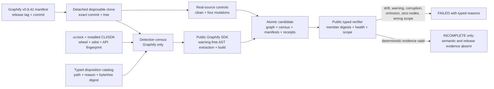

## 2026-08-14 — iteration KB-299-2

- Prior goal digest: iteration KB-299-1 and the first frozen independent review.
- Changed requirement: make the public verifier independently reconcile typed member
  schemas, exact Graphify release/runtime identity, source catalog bytes, graph/build
  counts, and the exact real-source control outcomes.
- Reason: both independent review axes found that a rehashed but malformed candidate
  could pass. Capturing SDK stderr then exposed two additional real-source conditions:
  an oversized JSON parser error and a duplicate-label build note.
- Evidence: 94 focused tests, exact Graphify 0.9.42 source commit and tree from iteration
  KB-299-1, and two byte-identical cold builds with AST digest
  `12696140fba80966578ad285494868f90ad4369bb6299e4f09004fabda761f3b`.
- Affected tickets: only #299. #300 and #289 remain blocked and unchanged.
- Disposition: exact-byte exclusions replace false approval of the parser error and
  warning-bearing fixture; the repaired candidate awaits a second frozen review.


## 2026-08-14 — iteration KB-299-3

- Prior goal digest: iteration KB-299-2 and AST digest
  `12696140fba80966578ad285494868f90ad4369bb6299e4f09004fabda761f3b`.
- Changed requirement: invalidate the `sample.lpk` exclusion and preserve both the valid
  LPK package file and resolved PAS file identity through an exact, receipted compatibility
  correction.
- Reason: a full real-source audit proved the warning was an upstream identity/provenance
  defect, not an ambiguous or disposable fixture. Exclusion contradicted complete
  self-extraction, while stderr approval and `dedup=False` remained lossy.
- Evidence: latest Graphify release v0.9.42 at `7fe58b0`; no exact upstream fix; 103 focused
  tests; two byte-identical cold builds; corrected AST digest
  `24061d9d20ccf0747b5e0e4b43a52ca184aae2f5d2052c3a0fe3a01c88fdddab`.
- Affected tickets: only #299. #300 and #289 remain blocked and unchanged.
- Disposition: retain the source-hash/shape-gated local correction until an accepted
  Graphify release supplies the equivalent path-preserving behavior; recommend, but do
  not create, an upstream issue without separate external-write authority.

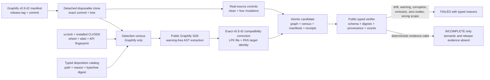

## 2026-08-14 — iteration KB-299-4

- Prior goal digest: iteration KB-299-3 and corrected AST digest
  `24061d9d20ccf0747b5e0e4b43a52ca184aae2f5d2052c3a0fe3a01c88fdddab`.
- Changed requirement: anchor the candidate to an immutable accepted authority record,
  validate every graph member and exact LPK proof at the public seam, and exclude reviewed
  metadata before Graphify extraction rather than erasing approved zero-node stderr.
- Reason: the second independent review replayed coherent source-manifest omission,
  non-object AST members, duplicate/wrong-provenance LPK evidence, and warning erasure that
  the prior verifier could falsely certify.
- Evidence: 114 focused tests; `ruff` and `ty` green; two byte-identical cold builds with
  410 detected inputs, 402 extracted inputs, five reviewed metadata paths, no zero-node
  paths, no approved warning classifications, and candidate manifest digest
  `199deeabdf74ae099cc96fc7625dd5529c8a27c96bce4b5fcacbccbc57e8cebb`.
- Affected tickets: only #299. #300 and #289 remain blocked and unchanged.
- Disposition: the new content-addressed candidate is frozen for final independent
  standards and specification review before commit and ship.

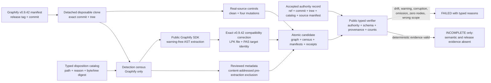

## 2026-08-14 — iteration KB-299-5

- Prior goal digest: iteration KB-299-4 and candidate manifest digest
  `199deeabdf74ae099cc96fc7625dd5529c8a27c96bce4b5fcacbccbc57e8cebb`.
- Changed requirement: reject coherently rehashed executable/runtime drift, fabricated
  warning classifications, duplicate metadata receipt paths, false AST admission counts,
  and structurally empty edges at the public verifier.
- Reason: final independent standards and specification replays found six remaining
  false-green combinations even though the real cold candidate bytes were correct.
- Evidence: 121 focused tests; `ruff` and `ty` green; two new byte-identical cold builds;
  accepted authority binds 410 detected and 402 extracted AST inputs; receipt arithmetic
  proves 402 extracted + five metadata + three exclusions = 410; candidate manifest and
  AST digests remain `199deeabdf74ae099cc96fc7625dd5529c8a27c96bce4b5fcacbccbc57e8cebb`
  and `24061d9d20ccf0747b5e0e4b43a52ca184aae2f5d2052c3a0fe3a01c88fdddab`.
- Affected tickets: only #299. #300 and #289 remain blocked and unchanged.
- Disposition: frozen for one final two-axis replay of the six repaired hostile cases.

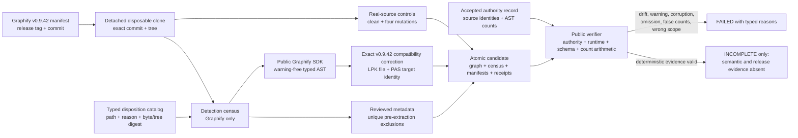

## 2026-08-14 — iteration KB-299-6

- Prior goal digest: iteration KB-299-5 and its first implementation commit.
- Changed requirement: require the candidate directory's direct entries to equal the
  manifest plus the exact required member set, with every expected entry a regular,
  non-symlink file.
- Reason: exact-head review added an unmanifested `semantic-receipt.json`; the public
  verifier ignored it and still reported deterministic completeness.
- Evidence: hostile file, directory, and symlink replays now fail; 124 focused tests plus
  `ruff` and `ty` pass.
- Affected tickets: only #299. #300 and #289 remain blocked and unchanged.
- Disposition: follow-up correction awaits full gates and exact-head review before ship.

## 2026-08-14 — iteration KB-299-7

- Prior goal digest: iteration KB-299-6 and its first exact-head review.
- Changed requirement: return the typed candidate-entry failure before reading any member.
- Reason: an expected FIFO was classified invalid but the subsequent byte read blocked.
- Evidence: expected FIFO now fails immediately; 125 focused tests plus `ruff` and `ty` pass.
- Affected tickets: only #299. #300 and #289 remain blocked and unchanged.
- Disposition: final correction awaits exact-head gates and bounded replay before ship.

## 2026-08-14 — iteration KB-299-8

- Prior goal digest: iteration KB-299-7 and PR #307 at `2ed62c3736cc`.
- Changed requirement: pin the runtime before controls and forbid required/ignored overlap.
- Reason: CodeRabbit reproduced two false-green public paths during PR review.
- Evidence: both hostile cases were RED before the fix and GREEN after it.
- Affected tickets: only #299. Graphify coupling observations remain typed advisory backlog.
- Disposition: the bounded PR-review fix awaits full exact-head gates before land.

## 2026-08-14 — iteration KB-300-1

- Prior goal digest: `bc50171ed9e64f8d4f05ae11f2077ff0b41cce40c85e5a3d146b34ce6d9c23e9`.
- Changed requirement: certify one representative immutable Graphify document through
  the real Graphify 0.9.42 `claude-cli` path and Claude Code Max OAuth, retain the
  envelope fields Graphify discards, forward accepted structured output into Graphify,
  and publish only an independently verified atomic candidate.
- Reason: issue #293 proved the real backend and exact model but its observation shim
  falsely rejected a valid `tool_use` success before Graphify could receive the fragment.
- Evidence: the only acceptance call used Claude Code 2.1.232, first-party Max, exact
  `claude-haiku-4-5-20251001`, one Graphify chunk, zero Graphify/API retries, and one
  bounded structured repair. It completed in 98.752 seconds for `$0.0910219`, with zero
  stderr, warnings, errors, denials, fallback, failed/uncovered chunks, or out-of-scope
  drops. The candidate contains 16 nodes, 14 edges, and two hyperedges; its manifest
  SHA-256 is `283b9b1221394a4ec7f7b1d456db248105a8090cd11f809dde374e05ab3aa5b2`.
- Affected tickets: #300 only. #301 remains unstarted and blocked.
- Disposition: real semantic acceptance is proven locally and awaits full gates,
  independent exact-head review, ship, and land.

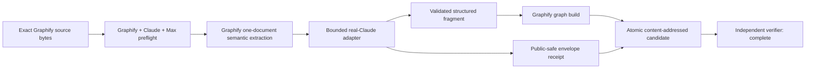

## 2026-08-14 — iteration KB-300-2

- Prior goal digest: iteration KB-300-1 and candidate manifest digest
  `283b9b1221394a4ec7f7b1d456db248105a8090cd11f809dde374e05ab3aa5b2`.
- Changed requirement: separate structurally valid but unapproved real output from the
  reviewed acceptance authority; remove host paths; bind the exact Graphify runtime,
  one-chunk ledger, JSON schema, arguments, safe environment names, and non-secret
  execution values; cross-check public envelope hashes, identity, tokens, durations, and
  cost; return typed failures for malformed hostile inputs.
- Reason: independent exact-tree review reproduced a synthetic coherent false-green,
  local-account path disclosure, and several receipt/verifier gaps without making a
  provider call.
- Evidence: the retained real result was privacy-redacted and mechanically rehashed
  without changing the semantic fragment or rerunning inference. Its reviewed manifest
  SHA-256 is `8d3407f5cca4c2ddca54d9a4f25df0727cbd5fd2fd378754d48afced220e94a7`;
  public verification returns `complete`, while any other coherent manifest remains
  `unapproved` until separately reviewed and pinned.
- Affected tickets: #300 only. #301 remains unstarted and blocked.
- Disposition: corrected retained evidence and hostile mutation controls await final
  two-axis replay, full gates, ship, and land.

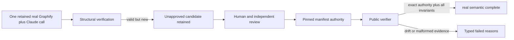

## 2026-08-14 — iteration KB-301-1

- Prior goal digest: issue #301 as unstarted successor to the landed issue #300
  real one-document semantic candidate.
- Changed requirement: construct an immutable complete-source inventory, provisional
  execution plan, exact-config cache namespace, atomic chunk staging boundary, typed
  abort path, and cold/reuse/rebuild/variance verifier before any provider call.
- Reason: extrapolating directly from one retained call would hide exact scope,
  unsupported input behavior, subscription bounds, cache ambiguity, and partial-run
  recovery risks.
- Evidence: the provider-free planner reproduces 372 detected semantic files, 474
  expanded units, 470 provisionally admitted units, and 57 chunks at the provisional
  20,000-token budget. Five public-seam tests use real Git/filesystem bytes and hostile
  mutations. No provider call has run.
- Affected tickets: #301 only. #302 remains unstarted and out of scope.
- Disposition: implementation remains incomplete pending independent source/code
  review, resolution of four content-addressed input decisions, and authorization of
  exactly one max-size real prototype.

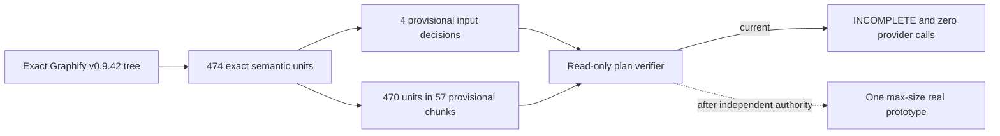

## 2026-08-14 — iteration KB-301-2

- Prior goal digest: iteration KB-301-1 and the first provider-free planner review
  freeze `1ff819205e2b4824c7d8fdc6dda288d92e0ad01aa2720409b4466cf5041ac4ea`.
- Changed requirement: bind authorization to the canonical manifest, execution config,
  and exclusions bytes; reconcile every ledger member against inventory; reject every
  warning; bind every effective runtime/cache bound; validate staged fragments with the
  issue #300 semantic invariants; refuse non-regular cache entries without following
  them; and require positive, plan-bound cold/reuse/rebuild/variance evidence.
- Reason: independent standards and acceptance reviews reproduced seven ways that a
  coherently mutated plan, malformed fragment/cache, or empty execution record could
  otherwise evade the intended fail-closed boundary.
- Evidence: 68 focused tests now exercise real Git/filesystem inputs and the retained
  issue #300 real semantic fragment. The tracked exact Graphify plan remains 474 units,
  470 provisionally admitted units, and 57 chunks, but verification is deliberately
  `failed` because its large-corpus warning is not suppressible. Its complete Git-source
  manifest now directly matches issue #299's accepted digest
  `da56d50eadb82b0889d8e9ad4b1260c98d4d8e6ab413e8abed5ddfcac0bdee68`; the #299
  AST admission does not certify #301's distinct semantic detection warning. No
  provider call ran.
- Affected tickets: #301 only. #302 remains unstarted and out of scope.
- Disposition: all seven implementation defects are corrected; the four input decisions
  and the warning-bearing execution plan remain unresolved, with
  `execution_authorized=false`, pending independent replay.

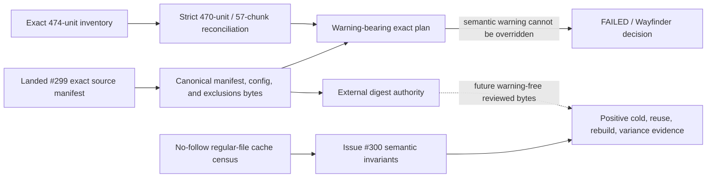

## 2026-08-14 — iteration KB-301-3

- Prior goal digest: iteration KB-301-2 and its second independent review freeze
  `a6fcaac547edcf56bf6971b1054afe7b0bdbdcb79507372887942a92a761561d`.
- Changed requirement: make authority-setting converge outside planner-hashed bytes;
  retain and validate each exact provider receipt and adapter envelope alongside its
  fragment; and reconstruct cold/reuse/rebuild/variance evidence exclusively from
  exact on-disk run directories rather than caller-supplied structs.
- Reason: independent replay proved the in-module authority constants changed the
  planner digest they attempted to authorize, caller fragments could erase provider
  warnings or truncation, and a coherent `RunEvidence` value did not prove that its
  chunks, receipts, ledger, or graph existed.
- Evidence: 73 focused tests use the retained real issue #300 provider receipt,
  adapter metadata, fragment, and real Graphify source bytes. They prove file-backed
  authority convergence; retained failed evidence for warnings, errors, truncation,
  uncovered and out-of-scope results; exact no-follow chunk/run censuses; graph and
  semantic count reconciliation; and rejection of fabricated caller structs. No
  provider call ran.
- Affected tickets: #301 only. #302 remains unstarted and out of scope.
- Disposition: the three round-two defects are corrected for independent replay. The
  exact 57-chunk plan remains warning-bearing, all four input decisions remain
  provisional, the external authority roots remain unset, and
  `execution_authorized=false`.

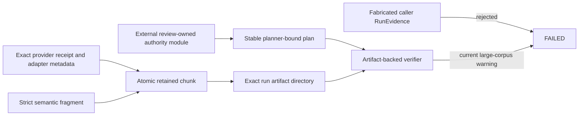

## 2026-08-14 — iteration KB-301-4

- Prior goal digest: iteration KB-301-3 and its round-two review freeze
  `587ef4c9ad830f64a01506bec5cc0c80f8442a968c7187a50f084c14b7abc43b`.
- Changed requirement: bind every retained provider/adapter result to the exact corpus
  plan, configuration, chunk, prompt/schema, and source Git bytes; then reconstruct the
  semantic graph deterministically from retained fragments and compare exact exported
  bytes and graph references instead of trusting receipt counts and digests.
- Reason: independent hostile replay showed an inherited issue #300 receipt could be
  mislabeled as a complete corpus chunk despite incompatible execution bounds, and a
  coherently edited graph plus receipt could evade count/hash-only reconciliation.
- Evidence: the focused suite retains the real issue #300 provider bytes and proves
  they fail the corpus contract for their unset token budget, single-file chunking, and
  disabled deep mode. Hostile source Git object/size, ordinal, prompt, and schema changes
  remain retained typed failures. The verifier rebuilds semantic-only graph bytes with
  Graphify's public SDK and rejects dangling references and non-identical graph bytes.
  No provider call ran.
- Affected tickets: #301 only. #302 remains unstarted and owns composition with the
  issue #299 AST graph.
- Disposition: the two round-three reconciliation defects are corrected for review;
  the exact plan remains warning-bearing, all four input decisions remain provisional,
  authority roots remain unset, and `execution_authorized=false`.

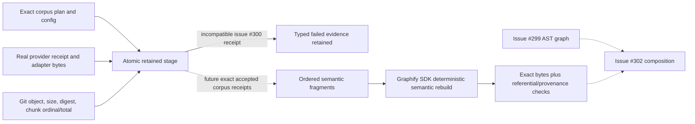

## 2026-08-14 — iteration KB-301-5

- Prior goal digest: iteration KB-301-4 and round-three freeze
  `8631210746f5689ae3436015f59e8615b666122bf7657651089c0a6c6189f7cc`.
- Changed requirement: anchor Graphify, Claude, prompt, and schema evidence to derived
  configuration and pinned source bytes; separate immutable config/cache identity from
  the per-run namespace so variance can be fresh without falsifying its config.
- Reason: a provider receipt and adapter could agree on coherently forged runtime or
  prompt identities, while the previous single namespace made variance impossible.
- Evidence: hostile replays mutate executable/help, Graphify runtime/version/semantic
  fingerprint, adapter and prompt digests, cache namespace, and run namespace. Specific
  typed failures survive coherent rehashing; positive controls admit a fresh variance
  run while retaining the config cache digest. No provider call ran.
- Affected tickets: #301 only. #302 remains unstarted.
- Disposition: both round-four seams are corrected for review. The plan remains
  warning-bearing, four inputs remain provisional, authority is unset, and
  `execution_authorized=false`.

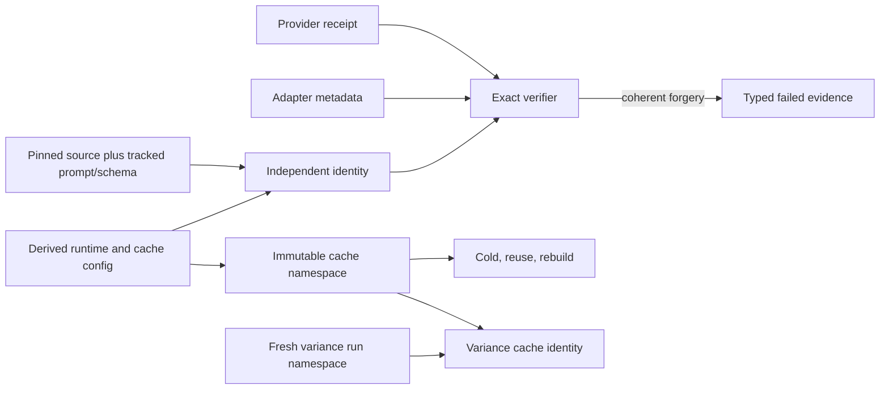

## 2026-08-14 — iteration KB-301-6

- Prior goal digest: iteration KB-301-5 and the accepted round-four content manifest
  `c08280400d5e0f1e1641aec25c4d0251b0e2c34362614818b71992946f2a2960`.
- Changed requirement: preserve Graphify's exact large-corpus cost advisory as a
  separately reviewable, content-addressed artifact while keeping all unknown warnings
  fatal; replace four generic omissions with typed intentional exclusions whose real
  source evidence is deterministically reverified.
- Reason: pinned Graphify source proves the exact message warns about provider token
  cost without truncating detection, while source inspection found deterministic
  authority for the SVG, HTML visualization, and README-bound presentation PNG files.
- Evidence: `advisories.json` binds Graphify commit
  `7fe58b0b0f3873be9a21c30106b8b8527c353aa6`, detector object
  `ab8e6b01116a23a3617e220830cdb22073d9784e`, thresholds, observed counts, and
  exact message. Hostile real-source tests reject SVG byte drift, HTML node or edge
  semantic drift, and README caption drift. No OCR result or provider call certifies
  these decisions.
- Affected tickets: #301 only. #302 remains unstarted.
- Disposition: the regenerated 372-source, 474-unit, 470-admitted, 57-chunk plan is
  structurally complete but `incomplete`; advisory and exclusion review states remain
  provisional, all external authority roots remain unset, and
  `execution_authorized=false`.

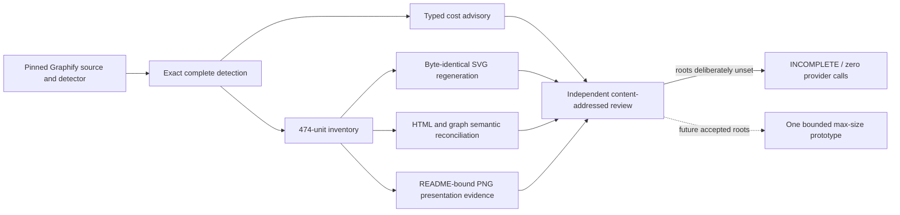

## 2026-08-14 — iteration KB-301-7

- Prior goal digest: iteration KB-301-6 and advisory/exclusion freeze
  `6031850d10c5e44b39d1863a17f0f0463e5a5fc7d3503d9171057ecd1c46a909`.
- Changed requirement: make exact source-snapshot recomputation mandatory at both the
  library and CLI verification seams; preserve HTML list order and multiplicity with
  explicit duplicate refusal; parse each README image binding by exact path, alt text,
  and adjacent caption rather than accepting global text.
- Reason: final independent hostile replay proved an artifact-only call could authorize
  coherently rewritten advisory counts, an HTML edge duplicate could survive sorted-set
  comparison, and unrelated README text could impersonate a PNG description.
- Evidence: real-source tests coherently rehash advisory bytes, duplicate both graph and
  HTML nodes/edges, and move the required alt text onto an unrelated image. Each now
  fails at its public seam; the CLI itself materializes and recomputes the exact pinned
  Graphify snapshot. No provider call ran.
- Affected tickets: #301 only. #302 remains unstarted.
- Disposition: external authority remains deliberately unset, all advisory/exclusion
  review states remain provisional, and `execution_authorized=false` pending narrow
  final review.

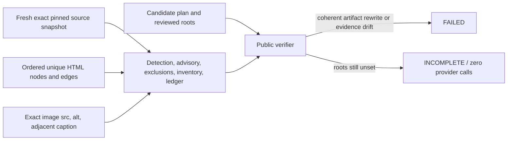

## 2026-08-14 — iteration KB-301-8

- Prior goal digest: iteration KB-301-7 and accepted final-hardening freeze
  `57c22cedf17582c1ed9d3784da777cf1b22df4c3ab8917a44db4bf717a50d566`.
- Changed requirement: set the four independently accepted external authority roots,
  run one exact max-size prototype, and distinguish adapter invocation from provider
  inference when the initial one-off launcher failed before crossing that boundary.
- Reason: exact authority converged without changing planner bytes. The initial launcher
  then passed only its seven-key overlay as the whole process environment, omitting
  HOME/XDG required by adapter auth preflight; empty adapter metadata and a 659 ms exit
  prove no provider inference occurred.
- Evidence: the append-only failed-attempt audit has SHA
  `abded372422a4563a37c16b0391f6cc75a5e2b04da784606b3ddaae175a34e34`
  and records one adapter invocation, zero provider inferences. The corrected launcher
  SHA is `86d432722b2de7243bc834e8a016119b3e976581332f983e49c0c225ff244e2b`;
  its no-inference receipt SHA
  `85805eb4b1197cee4462e34894d098e8a00364b3dcb3e43ebfd3dd8a684442e1`
  proves exact chunk 22/57, prompt identity, Max first-party auth, and required HOME/XDG
  names with `provider_inferences=0`.
- Affected tickets: #301 only. #302 remains unstarted.
- Disposition: exact plan authority is complete. Full-corpus execution remains blocked;
  the corrected single real inference remains gated on independent launcher review and
  permits no retry.

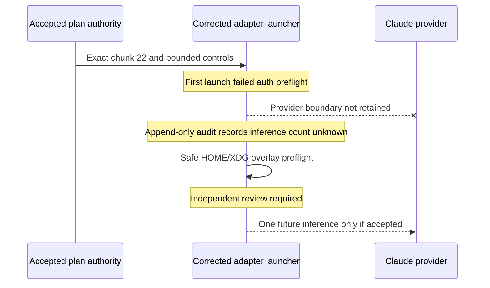

## 2026-08-14 — iteration KB-301-9

- Prior goal digest: iteration KB-301-8 and the blocked launcher review.
- Changed requirement: do not infer a provider boundary from elapsed time or empty
  adapter metadata; recover an exact retained phase diagnostic or classify the first
  attempt as unknown. Bind future preflight to exact launcher and adapter bytes and
  retain an atomic phase marker immediately before any real provider subprocess.
- Reason: independent replay found the inner adapter stderr was captured only in the
  one-off process and never persisted or emitted. The durable Codex execution record
  contains only the outer process result. Local `.agent`, session, and recovery-vault
  evidence contains no exact boundary diagnostic.
- Evidence: append-only `failed-attempt-audit-v2.json` preserves
  `adapter_invocations=1`, changes `provider_inferences` to `unknown`, and leaves the
  original outcome, stage receipt, and earlier audit unchanged. Hostile TDD replaces
  the launcher file and requires a typed identity failure. The adapter now writes an
  atomic, no-overwrite boundary-start artifact before its provider subprocess. A fresh
  no-inference preflight binds launcher `e931934c...` and adapter `4ac74d2b...`, proves
  Max first-party auth, and remains failed solely because plan authority is unset.
- Affected tickets: #301 and coordination blocker #292. #302 remains unstarted.
- Disposition: no corrected inference may run. The regenerated 470-unit/57-chunk plan
  is structurally complete but authority roots are deliberately unset after the adapter
  identity changed; execution remains unauthorized pending independent review and a
  fresh human/supervisor decision about the unknown prior attempt.

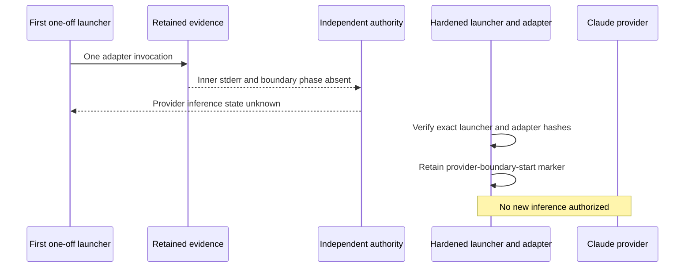

## 2026-08-14 — iteration KB-301-10

- Prior goal digest: iteration KB-301-9 and its final Standards review.
- Changed requirement: separate the durable provider-boundary marker state from the
  atomic prototype output and make marker creation truly no-clobber under concurrency.
- Reason: pre-creating the output directory for the marker would make the later atomic
  chunk publisher reject its destination. An existence check followed by atomic replace
  also allowed two concurrent writers to overwrite each other.
- Evidence: exact-topology TDD leaves the stage output absent while creating a dedicated
  sibling state directory, writes the boundary marker there, and then proves the stage
  output can be created independently. A concurrent hostile control permits exactly one
  `O_CREAT|O_EXCL` marker creator and rejects the other without replacement.
- Affected tickets: #301 only; #292 retains the unknown-boundary blocker. #302 remains
  unstarted.
- Disposition: replacement authority roots remain unset and no provider call is
  authorized. Fresh preflight binds plan `4f6ae7f0...`, config `d1afd40c...`, launcher
  `884630a1...`, and adapter `e37213de...`; it fails solely on unset plan authority.

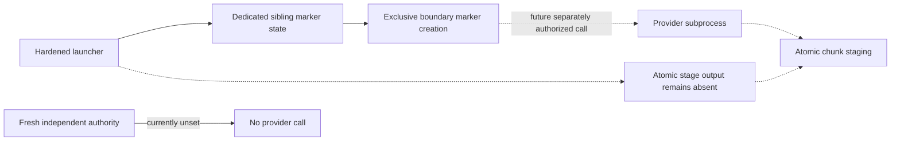

## 2026-08-14 — iteration KB-301-11

- Prior goal digest: iteration KB-301-10 and its Standards-accepted, Spec-blocked
  topology freeze.
- Changed requirement: compare canonical output/state identities rather than raw path
  spelling and reject traversal or symlink aliases before creating marker state.
- Reason: a lexical alias such as `alias/../state`, an equal canonical leaf, or a
  symlinked parent could bypass raw-path sibling/equality checks and redirect the marker.
- Evidence: hostile controls cover lexical parent traversal, identical/equivalent
  output-state paths, and a symlinked parent resolving into the output's real parent.
  Each fails before mutation and preserves output absence. The positive control returns
  the marker under the canonical state root. Preflight now also binds topology-contract
  SHA `29b5bbc3...` alongside launcher `0c5f10ed...` and adapter `e37213de...`.
- Affected tickets: #301 only. #302 remains unstarted.
- Disposition: roots remain unset, the first attempt remains unknown, and no corrected
  provider call is authorized. The v5 no-inference preflight fails solely because plan
  authority is unset.

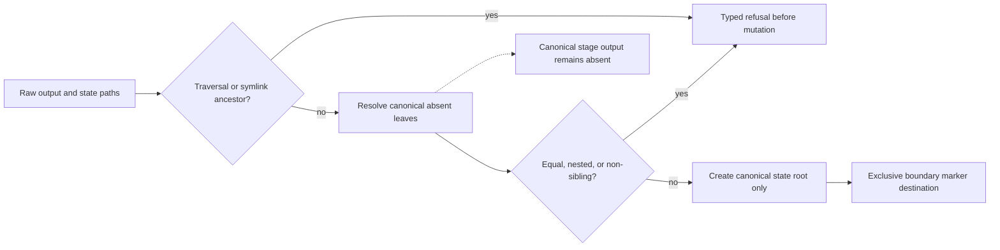

## 2026-08-14 — iteration KB-301-12

- Prior goal digest: iteration KB-301-11 and exact-head PR #309.
- Changed requirement: disposition every terminal CodeRabbit finding before land.
  Bind future inference count to the retained boundary marker, make missing/failed
  marker creation typed, close the marker/topology symlink-swap window, retain failed
  no-inference probe receipts, and remove tests' dependency on untracked runtime bytes.
- Reason: CodeRabbit's exact-head review reproduced five future-boundary or
  clean-checkout false greens after the first ship.
- Evidence: marker files and their parent directories are fsynced through no-follow
  directory descriptors; topology state is created relative to an anchored parent;
  timeout/OSError probe controls return typed reasons; the durable launcher reads the
  marker; exact-plan tests regenerate from the pinned Graphify Git source. Focused
  corpus tests pass without provider execution.
- Affected tickets: #301 and PR #309. #302 remains unstarted.
- Disposition: full-corpus execution and a corrected prototype remain unauthorized.
  The retained v5 preflight is historical evidence for the prior implementation bytes,
  not authority for this fix commit.

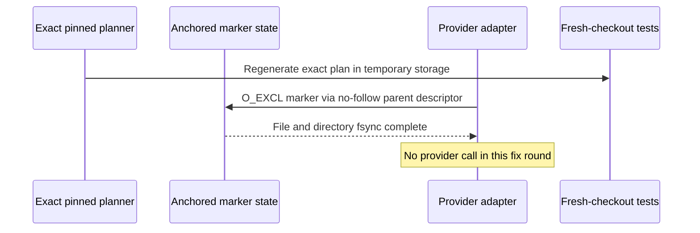

## 2026-08-14 — iteration KB-301-13

- Prior goal digest: iteration KB-301-12, PR #309 merge
  `e39a79fda8472084d6a9edb90ae810dc008cba88`, and the preserved first-attempt
  `provider_inferences=unknown` audit.
- Changed requirement: under fresh verbatim user authority, run exactly one corrected
  max-size prototype through Max OAuth with no API key, no tools, a `$0.25` cap, a
  120-second timeout, and no retry. Do not start the full corpus or issue #302.
- Reason: the 57-chunk plan required one real maximum-size observation before any cold
  run could be considered. Independent prelaunch review also found that a derived
  three-turn claim was not enforceable because Claude Code 2.1.232 exposes no
  `--max-turns` option; that claim was removed before the call.
- Evidence: authorization v2 SHA `8c95677d...`; no-inference preflight v7 SHA
  `a4c64df...`; reviewed plan manifest `41a39ffd...`; execution config `73b9ed95...`;
  exact chunk 22/57 and prompt `4162fec1...`. The exclusive provider-boundary marker
  records one provider-process-boundary invocation. Provider inference remains unknown.
  The call ended after 35,524 ms with Claude CLI subprocess return code zero, zero
  stderr, and a 53,947-byte stdout digest, but the adapter derived no typed
  result envelope, model usage, or structured output. The public-safe terminal artifacts
  are retained under `docs/agents/evidence/issue-301/corrected-max-chunk-terminal/`.
- Affected tickets: #301 and coordination receipt #292. #302 remains unstarted.
- Disposition: authority was consumed and no retry occurred. The stage failed closed;
  this is classified as an adapter-observation contract failure with the underlying
  provider/model outcome unresolved. Raw response bytes were intentionally not retained,
  so invalid JSON and a non-object JSON top level cannot be distinguished after the fact.
  Full-corpus execution remains blocked pending a separately reviewed no-call diagnostic
  improvement and a new explicit authority decision.

```mermaid
sequenceDiagram
    participant Authority as Fresh user authority
    participant Preflight as No-inference preflight
    participant Adapter as Claude adapter
    participant CLI as Claude CLI boundary
    participant Receipt as Typed evidence
    Authority->>Preflight: One corrected call only
    Preflight-->>Adapter: Exact roots and Max OAuth green
    Adapter->>Receipt: Durable boundary marker
    Adapter->>CLI: One subprocess invocation, no retry
    CLI-->>Adapter: rc 0, stderr 0, 53,947 stdout bytes
    Adapter->>Receipt: Failed typed envelope and stage
    Note over Adapter,CLI: Provider inference unknown; full corpus remains blocked
```

## 2026-08-14 — iteration KB-301-14

- Prior goal digest: iteration KB-301-13 and exact-head cold review of the retained
  failed max-chunk evidence.
- Changed requirement: revoke the consumed one-call authority from every executable
  default path, and separate #301's observed turn metadata from #300's independently
  accepted three-turn ceiling.
- Reason: cold replay proved deleting the output and marker state could otherwise make
  the historical authority runnable again. It also found that the shared envelope
  validator still applied an unenforceable three-turn limit to #301 after the bound had
  been removed from its reviewed authorization.
- Evidence: active authority roots are empty; a freshly materialized exact plan remains
  structurally complete but public verification returns `execution_authorized=false`
  with `plan-authority-unset`, `cost-advisory-review-required`, and
  `provisional-input-decisions`. A hostile prototype control fails before creating
  output or state. The #301 boundary adapter accepts and retains an observed positive
  four-turn envelope without an upper-bound claim; the unchanged #300 default still
  rejects it. Historical terminal artifacts remain byte-identical, and the consumption
  receipt classifies their old `turn-bound-exceeded` as a local post-parse reason.
- Affected tickets: #301 and coordination receipt #292. #302 remains unstarted.
- Disposition: the single-call authority is consumed and revoked. No retry, provider
  call, full-corpus execution, or successor ticket is authorized.

```mermaid
flowchart LR
    HIST["Historical accepted roots and one-call receipts"] --> USED["One boundary attempt"]
    USED --> REVOKE["Executable authority roots empty"]
    REVOKE --> VERIFY["Public verifier incomplete and unauthorized"]
    VERIFY --> STOP["No retry or full-corpus run"]
    TURNS["Observed num_turns metadata"] --> KB301["#301: positive count, no hard upper bound"]
    TURNS --> KB300["#300: accepted three-turn ceiling"]
```
