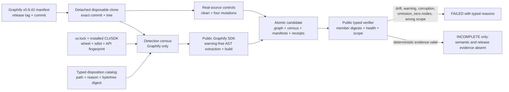
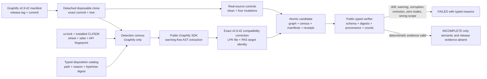
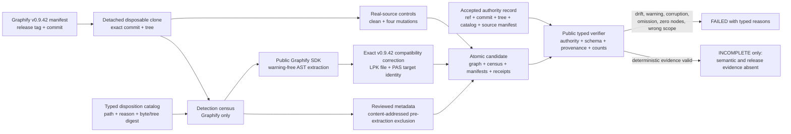
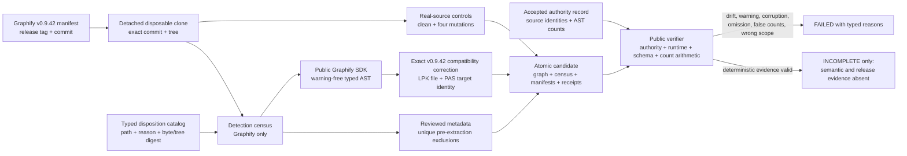
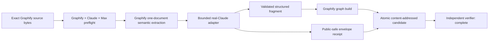
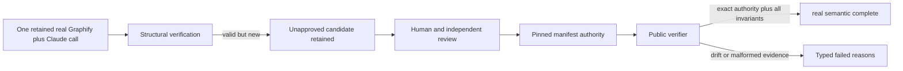

# Goal history

This append-only ledger records material goal revisions so session review and future
optimization can distinguish deliberate pivots from accidental drift.

## 2026-08-14 — iteration KB-299-1

- Prior goal digest: coordination handshake v14,
  `1adede6e1ff9bc9e5889a1d3813803cc157d6b0823b7c5bebce34e22acf669b1`.
- Changed requirement: implement issue #299 as the bounded Graphify 0.9.42-only
  deterministic admission and immutable AST baseline before semantic extraction.
- Reason: establish one reproducible tracer bullet without reopening the incomplete
  71-source corpus tracked by #289.
- Evidence: issue #299, spec #298, Graphify source commit
  `7fe58b0b0f3873be9a21c30106b8b8527c353aa6`, tree
  `15ca81a8dbd3ded7083c4b573197140e62e95fcc`.
- Affected tickets: #299 owns this iteration; #300 remains blocked on its verified
  deterministic candidate; #289 remains independent.
- Disposition: active until the branch is independently reviewed, shipped, landed,
  and reproduced from remote `main`.

## 2026-08-14 — iteration KB-299-2

- Prior goal digest: iteration KB-299-1 and the first frozen independent review.
- Changed requirement: make the public verifier independently reconcile typed member
  schemas, exact Graphify release/runtime identity, source catalog bytes, graph/build
  counts, and the exact real-source control outcomes.
- Reason: both independent review axes found that a rehashed but malformed candidate
  could pass. Capturing SDK stderr then exposed two additional real-source conditions:
  an oversized JSON parser error and a duplicate-label build note.
- Evidence: 94 focused tests, exact Graphify 0.9.42 source commit and tree from iteration
  KB-299-1, and two byte-identical cold builds with AST digest
  `12696140fba80966578ad285494868f90ad4369bb6299e4f09004fabda761f3b`.
- Affected tickets: only #299. #300 and #289 remain blocked and unchanged.
- Disposition: exact-byte exclusions replace false approval of the parser error and
  warning-bearing fixture; the repaired candidate awaits a second frozen review.

## 2026-08-14 — iteration KB-299-3

- Prior goal digest: iteration KB-299-2 and AST digest
  `12696140fba80966578ad285494868f90ad4369bb6299e4f09004fabda761f3b`.
- Changed requirement: invalidate the `sample.lpk` exclusion and preserve both the valid
  LPK package file and resolved PAS file identity through an exact, receipted compatibility
  correction.
- Reason: a full real-source audit proved the warning was an upstream identity/provenance
  defect, not an ambiguous or disposable fixture. Exclusion contradicted complete
  self-extraction, while stderr approval and `dedup=False` remained lossy.
- Evidence: latest Graphify release v0.9.42 at `7fe58b0`; no exact upstream fix; 103 focused
  tests; two byte-identical cold builds; corrected AST digest
  `24061d9d20ccf0747b5e0e4b43a52ca184aae2f5d2052c3a0fe3a01c88fdddab`.
- Affected tickets: only #299. #300 and #289 remain blocked and unchanged.
- Disposition: retain the source-hash/shape-gated local correction until an accepted
  Graphify release supplies the equivalent path-preserving behavior; recommend, but do
  not create, an upstream issue without separate external-write authority.

## 2026-08-14 — iteration KB-299-4

- Prior goal digest: iteration KB-299-3 and corrected AST digest
  `24061d9d20ccf0747b5e0e4b43a52ca184aae2f5d2052c3a0fe3a01c88fdddab`.
- Changed requirement: anchor the candidate to an immutable accepted authority record,
  validate every graph member and exact LPK proof at the public seam, and exclude reviewed
  metadata before Graphify extraction rather than erasing approved zero-node stderr.
- Reason: the second independent review replayed coherent source-manifest omission,
  non-object AST members, duplicate/wrong-provenance LPK evidence, and warning erasure that
  the prior verifier could falsely certify.
- Evidence: 114 focused tests; `ruff` and `ty` green; two byte-identical cold builds with
  410 detected inputs, 402 extracted inputs, five reviewed metadata paths, no zero-node
  paths, no approved warning classifications, and candidate manifest digest
  `199deeabdf74ae099cc96fc7625dd5529c8a27c96bce4b5fcacbccbc57e8cebb`.
- Affected tickets: only #299. #300 and #289 remain blocked and unchanged.
- Disposition: the new content-addressed candidate is frozen for final independent
  standards and specification review before commit and ship.

## 2026-08-14 — iteration KB-299-5

- Prior goal digest: iteration KB-299-4 and candidate manifest digest
  `199deeabdf74ae099cc96fc7625dd5529c8a27c96bce4b5fcacbccbc57e8cebb`.
- Changed requirement: reject coherently rehashed executable/runtime drift, fabricated
  warning classifications, duplicate metadata receipt paths, false AST admission counts,
  and structurally empty edges at the public verifier.
- Reason: final independent standards and specification replays found six remaining
  false-green combinations even though the real cold candidate bytes were correct.
- Evidence: 121 focused tests; `ruff` and `ty` green; two new byte-identical cold builds;
  accepted authority binds 410 detected and 402 extracted AST inputs; receipt arithmetic
  proves 402 extracted + five metadata + three exclusions = 410; candidate manifest and
  AST digests remain `199deeabdf74ae099cc96fc7625dd5529c8a27c96bce4b5fcacbccbc57e8cebb`
  and `24061d9d20ccf0747b5e0e4b43a52ca184aae2f5d2052c3a0fe3a01c88fdddab`.
- Affected tickets: only #299. #300 and #289 remain blocked and unchanged.
- Disposition: frozen for one final two-axis replay of the six repaired hostile cases.

## 2026-08-14 — iteration KB-299-6

- Prior goal digest: iteration KB-299-5 and its first implementation commit.
- Changed requirement: require the candidate directory's direct entries to equal the
  manifest plus the exact required member set, with every expected entry a regular,
  non-symlink file.
- Reason: exact-head review added an unmanifested `semantic-receipt.json`; the public
  verifier ignored it and still reported deterministic completeness.
- Evidence: hostile file, directory, and symlink replays now fail; 124 focused tests plus
  `ruff` and `ty` pass.
- Affected tickets: only #299. #300 and #289 remain blocked and unchanged.
- Disposition: follow-up correction awaits full gates and exact-head review before ship.

## 2026-08-14 — iteration KB-299-7

- Prior goal digest: iteration KB-299-6 and its first exact-head review.
- Changed requirement: return the typed candidate-entry failure before reading any member.
- Reason: an expected FIFO was classified invalid but the subsequent byte read blocked.
- Evidence: expected FIFO now fails immediately; 125 focused tests plus `ruff` and `ty` pass.
- Affected tickets: only #299. #300 and #289 remain blocked and unchanged.
- Disposition: final correction awaits exact-head gates and bounded replay before ship.

## 2026-08-14 — iteration KB-299-8

- Prior goal digest: iteration KB-299-7 and PR #307 at `2ed62c3736cc`.
- Changed requirement: pin the runtime before controls and forbid required/ignored overlap.
- Reason: CodeRabbit reproduced two false-green public paths during PR review.
- Evidence: both hostile cases were RED before the fix and GREEN after it.
- Affected tickets: only #299. Graphify coupling observations remain typed advisory backlog.
- Disposition: the bounded PR-review fix awaits full exact-head gates before land.

## 2026-08-14 — iteration KB-300-1

- Prior goal digest: `bc50171ed9e64f8d4f05ae11f2077ff0b41cce40c85e5a3d146b34ce6d9c23e9`.
- Changed requirement: certify one representative immutable Graphify document through
  the real Graphify 0.9.42 `claude-cli` path and Claude Code Max OAuth, retain the
  envelope fields Graphify discards, forward accepted structured output into Graphify,
  and publish only an independently verified atomic candidate.
- Reason: issue #293 proved the real backend and exact model but its observation shim
  falsely rejected a valid `tool_use` success before Graphify could receive the fragment.
- Evidence: the only acceptance call used Claude Code 2.1.232, first-party Max, exact
  `claude-haiku-4-5-20251001`, one Graphify chunk, zero Graphify/API retries, and one
  bounded structured repair. It completed in 98.752 seconds for `$0.0910219`, with zero
  stderr, warnings, errors, denials, fallback, failed/uncovered chunks, or out-of-scope
  drops. The candidate contains 16 nodes, 14 edges, and two hyperedges; its manifest
  SHA-256 is `283b9b1221394a4ec7f7b1d456db248105a8090cd11f809dde374e05ab3aa5b2`.
- Affected tickets: #300 only. #301 remains unstarted and blocked.
- Disposition: real semantic acceptance is proven locally and awaits full gates,
  independent exact-head review, ship, and land.

## 2026-08-14 — iteration KB-300-2

- Prior goal digest: iteration KB-300-1 and candidate manifest digest
  `283b9b1221394a4ec7f7b1d456db248105a8090cd11f809dde374e05ab3aa5b2`.
- Changed requirement: separate structurally valid but unapproved real output from the
  reviewed acceptance authority; remove host paths; bind the exact Graphify runtime,
  one-chunk ledger, JSON schema, arguments, safe environment names, and non-secret
  execution values; cross-check public envelope hashes, identity, tokens, durations, and
  cost; return typed failures for malformed hostile inputs.
- Reason: independent exact-tree review reproduced a synthetic coherent false-green,
  local-account path disclosure, and several receipt/verifier gaps without making a
  provider call.
- Evidence: the retained real result was privacy-redacted and mechanically rehashed
  without changing the semantic fragment or rerunning inference. Its reviewed manifest
  SHA-256 is `8d3407f5cca4c2ddca54d9a4f25df0727cbd5fd2fd378754d48afced220e94a7`;
  public verification returns `complete`, while any other coherent manifest remains
  `unapproved` until separately reviewed and pinned.
- Affected tickets: #300 only. #301 remains unstarted and blocked.
- Disposition: corrected retained evidence and hostile mutation controls await final
  two-axis replay, full gates, ship, and land.

