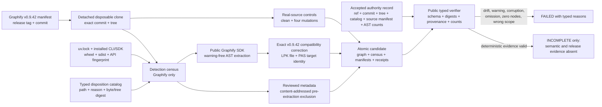

# Graphify deterministic baseline

Issue [#299](https://github.com/ray-manaloto/knowledge-base/issues/299) is the
Graphify-only tracer bullet for the expert bundle. It deliberately does not build the
other pinned sources and does not claim semantic or release completeness.

## Architecture and workflow



The source snapshot is immutable: detection and extraction use the same disposable
clone, Graphify caches live outside it, and the complete Git-blob manifest is checked
again after artifact export. The candidate is published only by an atomic directory
replacement after its own highest-level verification succeeds.

The control receipt uses independent disposable clones of the same real source:

- `clean` must complete;
- `unknown-file` must fail source admission;
- `changed-reviewed-file` must fail its disposition digest;
- `new-ignored-tracked-path` must change the reviewed ignored-tree digest; and
- `post-admission-snapshot-drift` must fail the second Git snapshot check.

## Public seam

Build from the pinned Graphify manifest and verify the resulting candidate:

```bash
mise run kb-graphify-baseline -- build
mise run kb-graphify-baseline -- controls
mise run kb-graphify-baseline -- verify
```

The build selects only `sources/graphify.manifest`. Derived output lives under
`graphify-out/graphify-baseline/` and is intentionally ignored by Git. Its
`manifest.json` binds every required member by SHA-256 and byte count.
The candidate directory itself must contain exactly `manifest.json` plus those required
regular-file members. Unmanifested files, directories, symlinks, and special entries fail
verification, so later-phase evidence cannot be smuggled beside an unchanged manifest.

A successful deterministic baseline returns exit code zero while reporting
`state=incomplete`, `deterministic_complete=true`, and exactly
`semantic-evidence-missing` plus `release-evidence-missing`. Those two later phases
belong to subsequent tickets. Any other reason is a failure, not a partial success.

## Certified 0.9.42 baseline

The acceptance run processed 410 detected inputs. It extracted 402 AST inputs after three
content-addressed fixture exclusions: `sample.luau` emits an intentional partial-syntax
warning; `sample.dmf` embeds the random snapshot path in node identifiers;
and `worked/rsl-siege-manager/graph.json` exceeds Graphify's JSON indexing safety cap.
Parser errors cannot be approved as zero-node evidence. Five content-addressed JSON
data/graph artifacts are recorded as reviewed metadata and excluded before extraction,
so the runtime receives no zero-node inputs and records no erased warning classification.

Graphify 0.9.42 gives the valid `sample.lpk` package file and its foreign `sample.pas`
reference the same LPK-salted ID. Its default build then drops one label and rewires the
package's `contains` edge into a self-loop. The baseline applies one source-hash- and
shape-gated compatibility correction before the public build: retain the LPK file node,
remove only the erroneous foreign-reference record, and retarget `SamplePackage contains`
to Graphify's already-extracted PAS-salted file node. Any changed bytes, labels, roles,
edge multiplicity, collision population, or already-fixed upstream shape fails closed.
The receipt records both final identities and the single rewritten edge.

The result contains 10,627 nodes, 21,945 edges, and zero hyperedges. It contains distinct
`sample.lpk` and `sample.pas` file nodes, and the package `contains` edge targets the PAS
node without duplicate-ID build output.

Two independent cold builds from different disposable snapshot paths produced identical
bytes for every candidate member. The AST graph SHA-256 is
`24061d9d20ccf0747b5e0e4b43a52ca184aae2f5d2052c3a0fe3a01c88fdddab`; the complete
candidate manifest SHA-256 is
`199deeabdf74ae099cc96fc7625dd5529c8a27c96bce4b5fcacbccbc57e8cebb`.
The public verifier anchors the release ref, commit, tree, catalog digest, and complete
source-manifest digest plus the 410/402 AST admission counts in an immutable accepted
authority record. It also rejects executable/runtime drift, warning classifications,
duplicate metadata receipts, incomplete edge objects, and count arithmetic that does not
reconcile. Rehashing a coherent but different candidate therefore cannot reauthorize
omitted source, changed trust roots, or fabricated runtime/build evidence.

## Upstream dependency

The latest official release remains
[v0.9.42](https://github.com/Graphify-Labs/graphify/releases/tag/v0.9.42) at the
pinned commit. No exact upstream issue, pull request, fix, or later release was present
at the acceptance check. The defect spans the release's
[LPK extraction](https://github.com/Graphify-Labs/graphify/blob/7fe58b0b0f3873be9a21c30106b8b8527c353aa6/graphify/extract.py#L3799-L3884),
[foreign-reference resolution](https://github.com/Graphify-Labs/graphify/blob/7fe58b0b0f3873be9a21c30106b8b8527c353aa6/graphify/extractors/resolution.py#L2924-L2973),
[target-file disambiguation](https://github.com/Graphify-Labs/graphify/blob/7fe58b0b0f3873be9a21c30106b8b8527c353aa6/graphify/extractors/resolution.py#L655-L785),
and [deduplication](https://github.com/Graphify-Labs/graphify/blob/7fe58b0b0f3873be9a21c30106b8b8527c353aa6/graphify/dedup.py#L424-L546).
The recommended upstream correction is to preserve the matched Pascal path, stamp the
foreign edge's real `target_file`, include `contains` in target-file disambiguation, and
emit no duplicate foreign-reference node when the unit resolves. Creating the upstream
issue remains a separate external-write decision.
