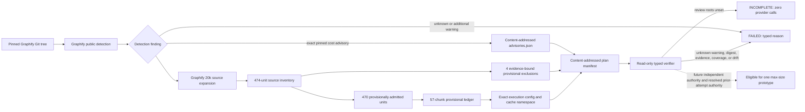
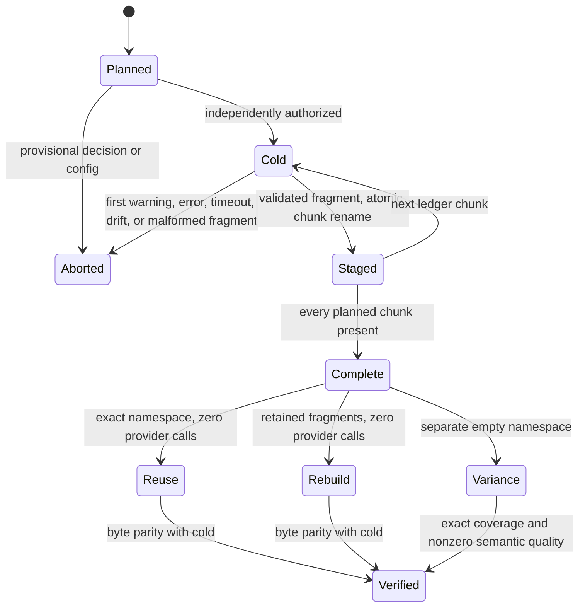
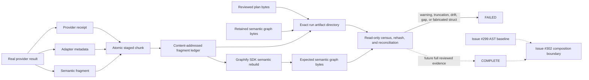
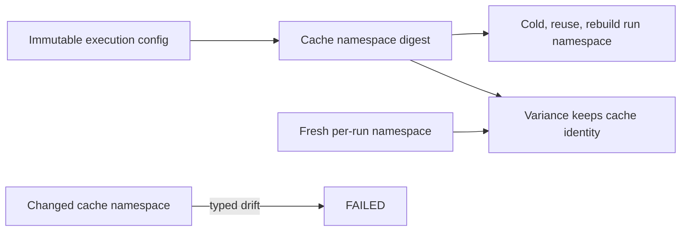

# Graphify Semantic Corpus

Issue [#301](https://github.com/ray-manaloto/knowledge-base/issues/301) scales the
landed one-document real-provider proof into a complete, reproducible plan for
the exact Graphify v0.9.42 tree. The current implementation is deliberately
provider-free: it proves what would run, how it would be cached, and how its
evidence would fail closed. It does not yet authorize the cold run.

## Current exact scope

| Boundary | Exact result |
|---|---:|
| Git commit | `7fe58b0b0f3873be9a21c30106b8b8527c353aa6` |
| Git tree | `15ca81a8dbd3ded7083c4b573197140e62e95fcc` |
| Detected semantic source files | 372 |
| Units after Graphify's 20,000-character expansion | 474 |
| Provisionally admitted units | 470 |
| Typed intentional exclusions awaiting review | 4 |
| Provisional token budget | 20,000 |
| Planned serial calls | 57 |
| Largest estimated chunk | 19,985 tokens / 5 units |

The four decisions are typed, content-addressed intentional exclusions rather than
silent omissions. `docs/demo-path.svg` must regenerate byte-for-byte from the tracked
generator. `worked/rsl-siege-manager/graph.html` must reconcile every embedded node
and edge semantic identity with its tracked companion `graph.json`. The two PNG files must
retain their exact Git bytes and exact README presentation bindings. Those checks run
again against the immutable source tree and fail on drift. They do not claim OCR or
image-semantic coverage, and remain `provisional` until independent review.

Graphify detection also emits one exact large-corpus token-cost advisory for this tree.
Pinned source identifies it as a cost warning, not a partial-detection or correctness
condition: detection still returns the complete typed file set and counts. The planner
therefore preserves the exact commit, detector Git object, thresholds, observed counts,
message, and provisional review state in `advisories.json`. Only that exact advisory is
eligible for separate review; any unknown or additional warning remains fatal. The
public verifier reports structurally complete but `execution_authorized=false`. Earlier
authority roots were deliberately cleared after the provider-boundary marker changed
the adapter and execution-config identities. The replacement roots must be reviewed
outside planner bytes; they do not authorize the full corpus run by themselves.

The planner reuses issue #299's accepted complete Git-source manifest digest
`da56d50eadb82b0889d8e9ad4b1260c98d4d8e6ab413e8abed5ddfcac0bdee68`, so the
source bytes are not in doubt. That baseline cannot erase this warning: #299's
warning-free receipt covers its 410-input deterministic admission and 402-input AST
extraction, whereas #301 invokes Graphify's official full-corpus `detect()` SDK for
semantic scope and receives 782 total files / about 1.37 million words. The only SDK
controls are symlink, Google Workspace, exclusion, cache-root, and gitignore behavior;
there is no supported warning-threshold override. Subdirectory-by-subdirectory
detection would avoid the aggregate advisory by construction and is therefore not
equivalent evidence. The advisory is neither suppressed nor hidden by partitioning.
Full provider execution remains blocked. One max-size prototype was authorized; its
first adapter launch failed after the one-off launcher replaced rather than overlaid the
ambient auth environment. Its exact inner stderr and boundary phase were not retained,
so timing and empty adapter metadata cannot prove whether provider inference began. The
append-only correction records one adapter invocation and `provider_inferences=unknown`.
No corrected inference is authorized. The hardened launcher binds exact launcher and
adapter bytes, preserves Max OAuth/runtime evidence, and uses a dedicated sibling state
directory so the adapter can exclusively create (`O_CREAT|O_EXCL`) a durable phase
marker immediately before any future real provider subprocess without pre-creating the
atomic staged-output directory.

Durable authored evidence is tracked under `docs/agents/evidence/issue-301/`:
the append-only unknown-boundary audit, the exact hardened launcher, and the last
pre-hardening no-inference preflight receipt (retained as historical evidence, not
current authorization). Plan, staging, and earlier preflight artifacts under
`graphify-out/` are derived runtime outputs and remain untracked. The implementation
module remains intentionally cohesive for this incomplete infrastructure slice;
splitting planning, provider evidence, and execution verification is deferred to the
continuation of #301 before full-corpus execution, when their public seams stop moving.

## Plan and execution boundary



The supported public seam is:

```text
mise run kb-graphify-semantic-corpus -- plan|run|verify [PATH]
```

- `plan` materializes the immutable pin, detects and expands the source, packs
  units, and atomically publishes the plan directory.
- `verify` materializes the exact pinned source snapshot and independently reruns
  detection, advisory counts/message, exclusions, inventory, and ledger before it can
  consider authority. The library verifier requires this snapshot argument; there is
  no artifact-only authorization bypass. It never invokes Claude.
- `run` currently fails closed with a typed abort receipt and zero provider
  calls. Provider execution remains intentionally unimplemented until review.

## Future cache and result lifecycle



The namespace binds source inventory, provisional decisions, chunk ledger, exact
Graphify runtime and semantic/LLM code, planner and adapter bytes, prompt/schema
fingerprints, Claude executable/help/version/requested and resolved model, endpoint and
auth policy, disabled tools, token and file caps, timeout, output/turn/cost/retry bounds,
concurrency, deep mode, and cache policy. A cold run may not read prior fragments.
Provider and adapter agreement is not authority: both are independently compared with
the derived config, tracked Graphify/Claude identities, tracked schema, and a prompt
reconstructed from pinned source bytes plus Graphify's deep extraction prompt bytes.
Each chunk retains the exact provider receipt, exact adapter metadata, semantic
fragment, and a content-addressed stage receipt. Warning-, error-, truncation-,
uncovered-, out-of-scope-, wrong-source-, or malformed evidence is retained with a
typed failed stage rather than rewritten as clean. Publication uses a directory rename
only after the issue #300 referential/source-scope checks and an exact regular-file
census. A stage also binds the exact plan manifest, execution config, prompt and schema
contracts, provider prompt, corpus chunk ordinal/total, source Git object, source byte
size/digest, 20,000-token budget, Graphify chunk/deep/retry/cache/timeout controls, and
Claude model/tool/auth/endpoint/turn/cost controls. The landed issue #300 receipt is
valuable real evidence, but its single-file chunking, disabled deep mode, and unset
token budget make it intentionally cache-incompatible with this corpus plan; it is
retained as a typed failed stage and cannot certify a corpus execution.

Execution-mode verification accepts artifact directories, never caller evidence
objects. It opens and lstat-censuses every run root and staged chunk; rehashes the
provider receipt, adapter metadata, fragment ledger, semantic fragments, and graph;
then reconciles exact plan units, source identities, counts, namespaces, config, and
call semantics. Reuse and rebuild must make zero provider calls and reproduce retained
byte identities; variance uses a fresh namespace and compares exact coverage and
positive semantic quality, not nondeterministic provider bytes. Review-owned authority
roots live in a separate importable module, outside the planner bytes whose digest the
execution config binds, so authorization can converge without changing its target.
The verifier deterministically rebuilds the semantic-only graph from the retained
fragments through Graphify's public SDK, requires exact exported graph-byte equality,
and independently checks node, edge, hyperedge, and source provenance references.
Issue #301 does not compose the issue #299 AST graph: issue #302 owns AST/semantic
composition and continuity, so claiming that continuity here would be a false positive.

The prototype marker and staged output deliberately have separate topologies. The
launcher creates only `graphify-semantic-corpus-prototype-corrected-state/` before the
adapter call; `graphify-semantic-corpus-prototype-corrected/` remains absent for the
atomic stage publisher. Marker creation is kernel-exclusive and refuses concurrent or
pre-existing destinations rather than checking and later replacing a path. The adapter
opens the marker parent as a no-follow directory descriptor, creates the marker relative
to that descriptor, and fsyncs both the file and parent directory.
Before creating state, the topology contract rejects lexical `..`, any symlinked
ancestor, equal or nested canonical identities, and non-sibling roots. It creates and
returns the marker only after creating state relative to an already-opened trusted
parent descriptor while leaving the resolved output absent. A later parent swap cannot
redirect marker creation: the adapter refuses a symlinked replacement. Preflight
independently binds the imported topology-contract
bytes as well as the launcher and adapter, so a changed helper cannot inherit an
accepted launcher identity.

The immutable cache namespace is the execution-config digest; a separate per-run
namespace locates staged artifacts. Cold, reuse, and rebuild share the cache-derived
run namespace. Variance keeps the same cache identity but uses a distinct fresh run
namespace. A changed cache namespace is drift, while a fresh variance run namespace is
the intended isolation control.

The exact-plan tests regenerate the plan from the pinned Graphify source into pytest
temporary storage. They do not read the untracked runtime corpus/prototype directories,
so a fresh checkout cannot inherit locally generated acceptance bytes.

The HTML exclusion preserves the source order and multiplicity of every normalized
node and edge identity. Duplicate node IDs or edge identities fail explicitly before
HTML and companion-graph lists are compared. The PNG evidence parser binds the exact
expected `src` to its own `alt`, and binds the graph screenshot to the immediately
following exact caption block; matching prose or alternate-image attributes elsewhere
in the README cannot satisfy the contract.





## Remaining decision sequence

1. Review the append-only correction that classifies the first adapter attempt's
   provider-inference state as unknown and disposition whether any new call is allowed.
2. Independently review the replacement plan/config, exact launcher/adapter identities,
   provider-boundary marker, and no-inference Max OAuth/runtime preflight.
3. Only under fresh explicit authority, make exactly one max-size real inference to
   measure packing, timeout, subscription use, and cost. Do not retry it or begin the
   57-call cold run.
4. Review its receipt, then either revise the plan or explicitly authorize the bounded
   cold run.
