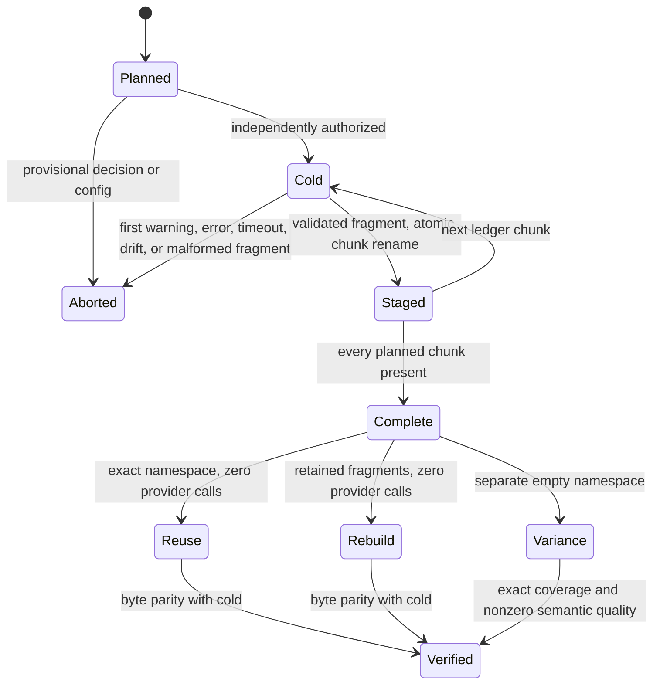
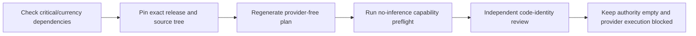
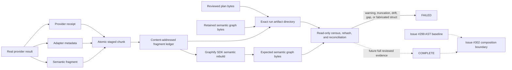
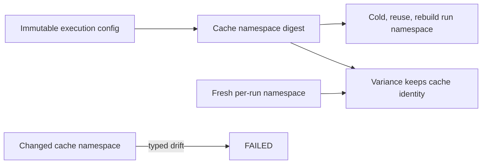

# Graphify Semantic Corpus

Issue [#301](https://github.com/ray-manaloto/knowledge-base/issues/301) scales the
landed one-document real-provider proof into a complete, reproducible plan for
the exact Graphify v0.9.43 tree. The planner and verifier are provider-free: they
prove what would run, how it would be cached, and how evidence fails closed. One
separately authorized max-chunk boundary attempt is retained below; it does not
authorize the cold run.

If you are new to this project, start with these four facts:

1. **Planning is safe and current.** It inspects pinned source and creates receipts;
   it does not contact a model provider.
2. **Execution is blocked.** Review authority is empty, four exclusions and one cost
   advisory remain provisional, and no retry or full-corpus call is authorized.
3. **Graphify 0.9.43 handles a Claude result shape our boundary did not.** A result may
   be one object or a JSON array of events ending in one result object.
4. **Claude is now bounded to three turns.** The option is documented and parser-
   supported in Claude Code 2.1.232 even though the short help text omits it.

## Recording plan authority

Run `kb-setup` from the repository root; the CLI intentionally treats the current
working directory as `repo_root`. The record verb plans into a retained
`.agent/kb/replan-<UTC timestamp>/` directory by default, or examines an existing
plan without modifying it:

```text
mise run kb-graphify-semantic-corpus -- record
mise run kb-graphify-semantic-corpus -- record --plan-dir .agent/kb/replan-<timestamp>
```

The verb copies only the six plan members into an isolated staging directory,
verifies that staged copy, and reports the exact digest delta. Changes to
`advisories_sha256` or `exclusions_sha256` are classified as reviewed DECISION
changes; changes to `plan_manifest_sha256` or `execution_config_sha256` are
IDENTITY/census changes. A dry run writes neither the canonical plan, authority,
nor ledger. Naming a decision digest that did not move is also refused.

Recording requires `--accept`. If a DECISION digest moved, the command additionally
requires `--accept-decision-change` with exactly the moved names, comma-separated:

```text
mise run kb-graphify-semantic-corpus -- record --plan-dir .agent/kb/replan-<timestamp> --accept
mise run kb-graphify-semantic-corpus -- record --plan-dir .agent/kb/replan-<timestamp> --accept --accept-decision-change advisories_sha256,exclusions_sha256
```

Acceptance preserves the old canonical directory as a timestamped `superseded`
directory, promotes only the verified member files, atomically rewrites
`python/src/kb_setup/graphify_semantic_corpus_authority.json`, and atomically appends
one bullet to `graphify-semantic-corpus-authority-ledger.md`. It then verifies the
new canonical plan against the JSON path explicitly. Any failure after mutation
restores the prior directory and both tracked files. Candidate verification and
post-accept verification each measure the live Graphify runtime (about four process
spawns in total on acceptance), but neither makes a provider call.

## Current exact scope

| Boundary | Exact result |
|---|---:|
| Graphify release | `v0.9.43` |
| Git commit | `7281f27eac568f77f50910f59f84543458f5dfd1` |
| Git tree | `6ae1c399eb1beef4f51106bbeecf72ee035fbeb6` |
| Detected semantic source files | 372 |
| Units after Graphify's 20,000-character expansion | 474 |
| Provisionally admitted units | 470 |
| Typed intentional exclusions awaiting review | 4 |
| Provisional token budget | 20,000 |
| Planned serial calls | 57 |
| Largest estimated chunk | 19,985 tokens / 5 units |

The four decisions are typed, content-addressed intentional exclusions rather than
silent omissions. `docs/demo-path.svg` must regenerate byte-for-byte from the tracked
generator. `worked/rsl-siege-manager/graph.html` must reconcile every embedded node
and edge semantic identity with its tracked companion `graph.json`. The two PNG files must
retain their exact Git bytes and exact README presentation bindings. Those checks run
again against the immutable source tree and fail on drift. They do not claim OCR or
image-semantic coverage, and remain `provisional` until independent review.

Graphify detection also emits one exact large-corpus token-cost advisory for this tree.
Pinned source identifies it as a cost warning, not a partial-detection or correctness
condition: detection still returns the complete typed file set and counts. The planner
therefore preserves the exact commit, detector Git object, thresholds, observed counts,
message, and provisional review state in `advisories.json`. Only that exact advisory is
eligible for separate review; any unknown or additional warning remains fatal. The
public verifier reports structurally complete but `execution_authorized=false`. Earlier
authority roots are deliberately empty because the one-call authority was consumed.
Accepted roots remain only in historical receipts. A fresh checkout therefore reports
`plan-authority-unset`, and deleting output/state cannot make the launcher runnable.
Any replacement roots require a new review outside planner bytes and do not authorize
the full corpus run by themselves.

The planner uses the refreshed complete Git-source manifest digest
`f839cca43889465bb43449f77880ec39a92f68bcee5d892ab8bfb18452a0690a`, so the
source bytes are not in doubt. That baseline cannot erase this warning: #299's
warning-free receipt covers its 410-input deterministic admission and 402-input AST
extraction, whereas #301 invokes Graphify's official full-corpus `detect()` SDK for
semantic scope and receives 786 total files / 1,379,183 words. The only SDK
controls are symlink, Google Workspace, exclusion, cache-root, and gitignore behavior;
there is no supported warning-threshold override. Subdirectory-by-subdirectory
detection would avoid the aggregate advisory by construction and is therefore not
equivalent evidence. The advisory is neither suppressed nor hidden by partitioning.
Full provider execution remains blocked. The first max-size adapter launch replaced
rather than overlaid the ambient auth environment. Its exact inner stderr and boundary
phase were not retained, so the append-only correction records one adapter invocation
and `provider_inferences=unknown`.

A fresh user authorization later allowed exactly one corrected call despite that unknown
state. At that time, review removed a derived three-turn claim because the short
`claude --help` output did not list `--max-turns`. Later official documentation and a
control-armed parser probe corrected that conclusion: Claude Code 2.1.232 accepts the
option, reports a numeric validation error for
`claude -p --max-turns not-an-integer`, and reports an unknown-option error for a
made-up flag. The deliberately invalid value guarantees rejection at argument parsing,
before Claude can read a prompt or cross a provider boundary. This check performs zero
provider inferences. See the official
[Claude Code CLI reference](https://code.claude.com/docs/en/cli-reference). The exact
historical user bounds were Max OAuth,
no API key, no tools, a `$0.25` cap, a 120-second timeout, and no retry. Fresh preflight
proved the reviewed plan, launcher, adapter, prompt, Max first-party auth, and absent
output/state roots before the call. The adapter started one Claude CLI subprocess at the
reviewed provider boundary and failed closed after 35,524 ms. It was not retried. The
marker proves one process-boundary invocation; provider inference remains unknown. Safe
receipts preserve a 53,947-byte CLI stdout digest but not the raw response; the adapter could not derive a typed result
envelope, model usage, or structured output from those bytes. This is an
adapter-observation contract failure. It does not prove a provider or model failure, and
it does not authorize the 57-chunk run. The preserved terminal metadata's
`turn-bound-exceeded` reason came from the old post-parse policy after stdout could not
be typed; it is not evidence of the provider's turn count. Future #301 calls now pass
`--max-turns 3` to Claude and independently reject a typed result reporting more than
three turns. Historical #300 receipts remain readable under their original 17-argument
contract; the new #301 command has 19 arguments because it adds the flag and value.

The historical 53,947 bytes cannot be classified more narrowly: the old parser mapped
invalid UTF-8, invalid JSON, and valid non-object JSON to the same empty dictionary and
discarded the parse status. That evidence remains
`untyped-response-cause-underdetermined`; no source-level inference can recover which
case occurred. Future adapter evidence now parses stdout once and embeds a sanitized,
content-free observation in the same atomically written metadata record. The observation
contains only the response digest/size, UTF-8 and JSON validity, a finite top-level kind,
event/result counts, the selected result index, a byte-indexed error offset, and a
trailing-data boolean. UTF-8 decode failures already
report byte positions; JSON character positions are converted against the decoded UTF-8
prefix before retention, so every nonnegative offset uses the same unit. It contains no raw bytes, decoded
text, excerpts, keys, or values. Its canonical digest and response identity are
cross-bound before #301 staging can accept provider evidence. This instrumentation does
not authorize another call and does not retrospectively classify the preserved attempt.
The one parse is strict JSON: Python-only numeric constants (`NaN`, positive infinity,
and negative infinity) are rejected as the content-free `non-json-constant` category,
including when they appear only in otherwise ignored object fields. Their spelling or
value is not retained, and they cannot produce an `accepted-object` observation.
The same fail-closed boundary classifies only two other known decoder limits:
`numeric-limit` for an integer rejected by Python's bounded integer conversion and
`nesting-limit` for `RecursionError` during JSON container decoding. A JSON array is
accepted only when every element is an object, exactly one element has `type=result`,
and that result is the final element. Empty arrays, scalar elements, missing or multiple
results, and trailing events all fail closed without retaining their keys or values.
Exact hostile
fixtures use a 5,000-digit object field and a 50,000-deep array. Both retain only the
response identity, outer kind, and typed category; unrelated implementation exceptions
are not swallowed.

Durable authored evidence is tracked under `docs/agents/evidence/issue-301/`:
the append-only unknown-boundary audit, the exact hardened launcher, and the last
pre-hardening no-inference preflight receipt (retained as historical evidence, not
current authorization). Plan, staging, and earlier preflight artifacts under
`graphify-out/` are derived runtime outputs and remain untracked. The implementation
module remains intentionally cohesive for this incomplete infrastructure slice;
splitting planning, provider evidence, and execution verification is deferred to the
continuation of #301 before full-corpus execution, when their public seams stop moving.

## Plan and execution boundary

```mermaid
flowchart LR
    PIN["Pinned Graphify Git tree"] --> DETECT["Graphify public detection"]
    DETECT --> WARN{"Detection finding"}
    WARN -->|"exact pinned cost advisory"| ADV["Content-addressed advisories.json"]
    WARN -->|"unknown or additional warning"| FAILED["FAILED: typed reason"]
    WARN --> EXPAND["Graphify 20k source expansion"]
    EXPAND --> INV["474-unit source inventory"]
    INV --> DECIDE["4 evidence-bound provisional exclusions"]
    INV --> ADMIT["470 provisionally admitted units"]
    ADMIT --> PACK["57-chunk provisional ledger"]
    PACK --> CONFIG["Exact execution config and cache namespace"]
    ADV --> MANIFEST["Content-addressed plan manifest"]
    DECIDE --> MANIFEST
    CONFIG --> MANIFEST
    MANIFEST --> VERIFY["Read-only typed verifier"]
    VERIFY -->|"review roots unset"| INCOMPLETE["INCOMPLETE: zero provider calls"]
    VERIFY -->|"unknown warning, digest, evidence, coverage, or drift"| FAILED
    VERIFY -->|"historical reviewed one-call authority"| PROTO["One max-size prototype"]
    PROTO -->|"53,947-byte CLI stdout not typed"| BLOCKED["FAILED CLOSED: no retry"]
    BLOCKED --> REVOKE["Active authority roots cleared"]
    FUTURE["Future separately authorized stdout"] --> PARSE["One in-memory parse"]
    PARSE --> SAFE["Sanitized observation plus digest in atomic metadata"]
    SAFE --> STAGE{"#301 evidence checks"}
    STAGE -->|"invalid UTF-8/JSON or rejected array"| FAILED
    STAGE -->|"one object or one final array result"| PROTO
```



The supported public seam is:

```text
mise run kb-graphify-semantic-corpus -- plan|run|verify [PATH]
```

- `plan` materializes the immutable pin, detects and expands the source, packs
  units, and atomically publishes the plan directory.
- `verify` materializes the exact pinned source snapshot and independently reruns
  detection, advisory counts/message, exclusions, inventory, and ledger before it can
  consider authority. The library verifier requires this snapshot argument; there is
  no artifact-only authorization bypass. It never invokes Claude.
- `run` currently fails closed with a typed abort receipt and zero provider
  calls. Provider execution remains intentionally unimplemented until review.

## Future cache and result lifecycle



The namespace binds source inventory, provisional decisions, chunk ledger, exact
Graphify runtime and semantic/LLM code, planner, semantic-policy module, and adapter
bytes, prompt/schema
fingerprints, Claude executable/help/version/requested and resolved model, endpoint and
auth policy, disabled tools, token and file caps, timeout, three-turn cap,
output/cost/retry bounds,
concurrency, deep mode, and cache policy. A cold run may not read prior fragments.
Provider and adapter agreement is not authority: both are independently compared with
the derived config, tracked Graphify/Claude identities, tracked schema, and a prompt
reconstructed from pinned source bytes plus Graphify's deep extraction prompt bytes.
Each chunk retains the exact provider receipt, exact adapter metadata, semantic
fragment, and a content-addressed stage receipt. Warning-, error-, truncation-,
uncovered-, out-of-scope-, wrong-source-, or malformed evidence is retained with a
typed failed stage rather than rewritten as clean. Publication uses a directory rename
only after the issue #300 referential/source-scope checks and an exact regular-file
census. A stage also binds the exact plan manifest, execution config, prompt and schema
contracts, provider prompt, corpus chunk ordinal/total, source Git object, source byte
size/digest, 20,000-token budget, Graphify chunk/deep/retry/cache/timeout controls, and
Claude model/tool/auth/endpoint/cost/turn controls. The adapter invokes the pinned
Claude CLI with `--max-turns 3`; the parser-only preflight proves that hidden-help
option is accepted before any future provider boundary can start. The landed
issue #300 receipt is
valuable real evidence, but its single-file chunking, disabled deep mode, and unset
token budget make it intentionally cache-incompatible with this corpus plan; it is
retained as a typed failed stage and cannot certify a corpus execution.

Execution-mode verification accepts artifact directories, never caller evidence
objects. It opens and lstat-censuses every run root and staged chunk; rehashes the
provider receipt, adapter metadata, fragment ledger, semantic fragments, and graph;
then reconciles exact plan units, source identities, counts, namespaces, config, and
call semantics. Reuse and rebuild must make zero provider calls and reproduce retained
byte identities; variance uses a fresh namespace and compares exact coverage and
positive semantic quality, not nondeterministic provider bytes. Review-owned authority
roots live in a separate importable module, outside the planner bytes whose digest the
execution config binds, so authorization can converge without changing its target.
The verifier deterministically rebuilds the semantic-only graph from the retained
fragments through Graphify's public SDK, requires exact exported graph-byte equality,
and independently checks node, edge, hyperedge, and source provenance references.
Issue #301 does not compose the issue #299 AST graph: issue #302 owns AST/semantic
composition and continuity, so claiming that continuity here would be a false positive.

The prototype marker and staged output deliberately have separate topologies. The
launcher creates only `graphify-semantic-corpus-prototype-corrected-state/` before the
adapter call; `graphify-semantic-corpus-prototype-corrected/` remains absent for the
atomic stage publisher. Marker creation is kernel-exclusive and refuses concurrent or
pre-existing destinations rather than checking and later replacing a path. The adapter
opens the marker parent as a no-follow directory descriptor, creates the marker relative
to that descriptor, and fsyncs both the file and parent directory.
Before creating state, the topology contract rejects lexical `..`, any symlinked
ancestor, equal or nested canonical identities, and non-sibling roots. It creates and
returns the marker only after creating state relative to an already-opened trusted
parent descriptor while leaving the resolved output absent. A later parent swap cannot
redirect marker creation: the adapter refuses a symlinked replacement. Preflight
independently binds the imported topology-contract
bytes as well as the launcher and adapter, so a changed helper cannot inherit an
accepted launcher identity.

The immutable cache namespace is the execution-config digest; a separate per-run
namespace locates staged artifacts. Cold, reuse, and rebuild share the cache-derived
run namespace. Variance keeps the same cache identity but uses a distinct fresh run
namespace. A changed cache namespace is drift, while a fresh variance run namespace is
the intended isolation control.

The exact-plan tests regenerate the plan from the pinned Graphify source into pytest
temporary storage. They do not read the untracked runtime corpus/prototype directories,
so a fresh checkout cannot inherit locally generated acceptance bytes.

## Takeover checkpoint

This section is the shortest safe path for a new developer or agent.



Current local, ignored evidence is under `.agent/kb/`:

- `issue-301-plan-0943-final-v3/` is the provider-free Graphify 0.9.43 plan. Its plan
  manifest digest is
  `169fc674a1d0352e561d6bad21115a395f760ec1bf0d52d3e9a5c6158c246956`.
- The deterministic AST baseline still describes its historical v0.9.42 source tree,
  but its runtime identity now binds the project-wide Graphify 0.9.43 wheel and source
  distribution. Source evidence and the tool used to read it are separate identities.
- `issue-301-0943-no-inference-preflight.json` is the historical pre-review receipt. It records
  zero provider inferences, Max first-party OAuth, Claude Code 2.1.232, chunk 22 of 57,
  the unchanged 84,029-byte prompt, and the three-turn-cap capability probe. Its code
  identities predate the two review corrections below, so it is historical rather than
  current authorization evidence.
- `issue-301-0943-no-inference-preflight-final-v2.json` is the current post-review local
  receipt;
  its tracked copy is
  `docs/agents/evidence/issue-301/no-inference-preflight-0943.json`. It records zero
  provider inferences and exactly one reason: `plan-not-authorized`. Its `failed` status
  means **do not call the provider**; it does not mean the model failed.

The first identity review caught two blockers before accepting those digests. The plan
did not transitively bind `graphify_semantic_slice.py`, so an accepted plan could inherit
changed envelope policy. The tracked launcher also parsed stdout a second time with
plain `json.loads`, bypassing the strict array contract. Both are now corrected: the
execution config binds the semantic-policy module hash, hostile policy drift yields
`config-contract-mismatch`, and the launcher calls the adapter's strict normalizer.
An independent exact-digest re-review accepted only the frozen prototype-contract and
launcher identities. The executable plan digests now live in
`python/src/kb_setup/graphify_semantic_corpus_authority.json`; the Python module reads
those bytes at import and fails closed if the data file is missing. Human-readable
transitions continue in `graphify-semantic-corpus-authority-ledger.md`.

A later cold whole-branch review caught three compatibility regressions outside those
two frozen identities. The shared current manifest had made the historical v0.9.42 AST
baseline unreproducible; the #300 preflight still demanded an installed 0.9.42 SDK; and
the shared adapter's new 19-argument command no longer matched #300's retained
17-argument verifier. The correction derives an explicit historical source pin from the
reviewed Graphify remote, lets structural verification recognize either exact historical
or current runtime while public authority still recognizes only the historical receipt,
and adds `--max-turns 3` only when the #301 provider-boundary marker is configured.
Provider-free public probes now complete for the current #300 preflight and historical
baseline controls.

To reproduce the current state:

```text
mise run kb-graphify-semantic-corpus -- plan .agent/kb/issue-301-plan-0943-final-v3
mise run kb-graphify-semantic-corpus -- verify .agent/kb/issue-301-plan-0943-final-v3
```

The second command must report `structural_complete=true`,
`execution_authorized=false`, and exactly these reasons:
`plan-authority-unset`, `cost-advisory-review-required`, and
`provisional-input-decisions`. Do not turn those reasons into authority roots during
routine implementation. The review-owned identity digests and the content-decision
roots answer different questions.

For long-running goals, repeat the critical/currency dependency check at a documented
checkpoint instead of assuming the opening versions remain current. Preserve the old
plan and receipts as historical evidence, pin the new exact release, rerun focused SDK
and source-admission tests, then regenerate a new plan namespace. If a currency command
is launched twice, compare every generated page first; keep the later run only when the
pages differ solely by their timestamp. Never delete unique or unclassified bytes.

The HTML exclusion preserves the source order and multiplicity of every normalized
node and edge identity. Duplicate node IDs or edge identities fail explicitly before
HTML and companion-graph lists are compared. The PNG evidence parser binds the exact
expected `src` to its own `alt`, and binds the graph screenshot to the immediately
following exact caption block; matching prose or alternate-image attributes elsewhere
in the README cannot satisfy the contract.





## Remaining decision sequence

1. Preserve the first-attempt unknown audit and corrected one-call terminal receipts
   without rewriting either history.
2. Independently review the new launcher and prototype-contract code identities. This
   may update their review-owned digests, but must not populate plan/exclusion/advisory
   authority roots.
3. Regenerate the no-inference receipt after that review. It must still report zero
   provider inferences and an unauthorized plan.
4. Review and land this no-provider slice. Its fixtures prove parser, command, and
   receipt behavior; they do not certify a future Claude or Graphify result.
5. Keep the cold 57-chunk run and issue #302 blocked. Any later provider call requires
   new explicit authority; the corrected prototype authority is consumed.

```mermaid
sequenceDiagram
    participant Review as Independent review
    participant Adapter as Hardened adapter
    participant CLI as Claude CLI boundary
    participant Evidence as Public-safe evidence
    Review->>Adapter: Exact one-call authorization
    Adapter->>Evidence: fsync provider-boundary-start marker
    Adapter->>CLI: One subprocess invocation, no tools, no retry
    CLI-->>Adapter: rc 0, stderr 0, 53,947 stdout bytes
    Adapter->>Evidence: Empty typed envelope and failed stage
    Evidence-->>Review: Hashes and typed reasons, raw response excluded
    Note over Adapter,CLI: Provider inference unknown; no retry or full-corpus run
```

## Launching the corpus run

The full run is projected at roughly 4.8h of wall clock (26 chunks, post-dedupe
per #414 — was 58 chunks / ~10.6h pre-dedupe — at concurrency 1, ~11
minutes/chunk measured), and a single Bash tool call is capped at roughly 600s
regardless of a larger `timeout` argument — so it cannot be driven from one
foreground call.

- **Verify before spending.** `mise run kb-graphify-semantic-corpus -- verify`
  is provider-free and fast; confirm `execution_authorized: true` before
  spending anything on `run`.
- **Use the harness background run, with in-turn polling.** Launch the `run`
  action as a background run and poll its log in later turns rather than
  holding one foreground call open across chunks.
- **Never `&`-detach a local `mise run`.** A backgrounded local task gets
  reaped when the turn goes idle — the harness background run stays tracked
  across turns; a shell `&` does not (`long-running-command-hangs.md` rule 2).
- **The mise `timeout` is a wall-clock hang guard, not the spend cap.** The
  money is bounded separately by `_MAX_TOTAL_COST_USD` (63.0, post-dedupe; was
  140.0 pre-dedupe — see its comment in `graphify_semantic_corpus.py` for the
  arithmetic). The task's own `timeout = "16h"` is roughly 3.3x the projected
  4.8h (was roughly 1.5x the projected 10.6h pre-dedupe), sized to catch a
  genuinely wedged run without firing on ordinary chunk-to-chunk variance.
- **A restart re-publishes already-staged evidence; it does not re-buy anything
  for free.** `_verified_stages` re-publishes every chunk whose stage directory
  already holds verified evidence, so a restart does not write duplicate
  artifacts for what is already staged. This does NOT make a restart free:
  `seeded_spend` still carries the prior run's cumulative cost forward, and
  Graphify itself re-buys EVERY chunk in the corpus at full price on every
  restart — not only the ones it ends up re-publishing — which is exactly why
  the cap above is sized for one full restart rather than for one full run.
