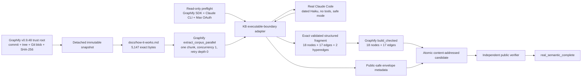
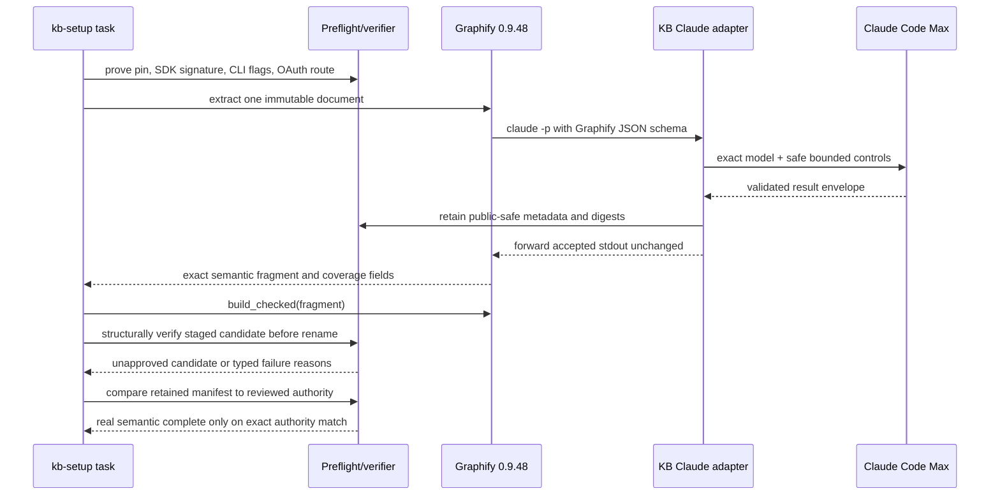

# Graphify real-Claude semantic slice

Issue [#300](https://github.com/ray-manaloto/knowledge-base/issues/300) proves the
smallest real semantic path through the exact Graphify 0.9.48 source and Claude Code
Max subscription. It complements the deterministic AST candidate from issue #299; it
does not replace or rebuild that candidate.

## What was built



The adapter exists because stock Graphify parses the Claude result envelope and then
discards model set, auth class, turns, terminal state, denials, duration, cost, and the
raw structured-output digest. The adapter observes that real executable boundary,
records only allowlisted public metadata, and forwards accepted stdout unchanged to
Graphify. It does not patch Graphify or fabricate provider behavior.

## Execution sequence



## Public commands

```bash
mise run kb-graphify-semantic-slice -- preflight
mise run kb-graphify-semantic-slice -- run
mise run kb-graphify-semantic-slice -- verify
```

`preflight` performs no inference. `run` refuses a pre-existing destination, uses one
unpublished sibling temporary directory, structurally verifies it, and only then renames
the whole candidate into place as `unapproved`. This preserves a new real result for
human review without allowing it to certify itself. `verify` never invokes Graphify or
Claude; it checks the reviewed manifest authority, regular-file
membership, strict schemas, every size and digest, the immutable source authority,
runtime/auth/model/argument bindings, exact non-secret execution controls, exact one-chunk
coverage, exact Claude-structured-output-to-fragment binding, referential integrity,
counts, cost/duration/token consistency, public digest formats, and all negative evidence.

## Retained first real result

- Candidate manifest SHA-256:
  `61006e39d3d6ea20e1bb41deff64ff3cffbcf1894db92920a9006924c19f4cc9`.
- Source: Graphify `v0.9.48`, commit
  `b2cd36267456c166788c95be6e68574064a92a42`, tree
  `be8636735370ed82708bb53eba33170e85acc369`, and exact 5,147-byte
  `docs/how-it-works.md` blob (byte-identical to the v0.9.42/v0.9.45 snapshots).
- Runtime: Graphify `0.9.48`; Claude Code `2.1.238`; Claude.ai first-party Max;
  sole `claude-haiku-4-5-20251001` model.
- Bounds: one Graphify chunk, concurrency one, adaptive retry depth zero, API retries
  zero, at most one structured repair, 120 seconds, no tools/MCP/browser, and a
  `$0.25` ceiling.
- Observed: one subprocess attempt, three turns, `tool_use` stop with success/completed
  state, zero stderr, warnings, errors, denials, fallback, uncovered files, failed chunks,
  or out-of-scope drops; `$0.0556709` estimated subscription usage.
- Output: 18 semantic nodes, 17 edges, two hyperedges; Graphify rebuilt 18 nodes and
  17 edges; the public verifier returned `real_semantic_complete=true` with no reasons.

The candidate under `graphify-out/graphify-semantic-slice/` contains only the exact
semantic fragment, public-safe adapter metadata, receipt, and manifest. It excludes the
raw prompt, raw provider response, credentials, email, organization identifiers, and
source payload. Public executable identity is the stable name `claude`; the receipt binds
its reviewed content hash and version without retaining a host path or local account name.

## Failure behavior

Any pin/signature/CLI/auth/routing drift fails before inference. A nonzero provider exit,
stderr, timeout, malformed or partial structured output, wrong model/provider, excess
turns, denial, fallback, warning, failed or uncovered chunk, source mutation, broken edge,
digest mismatch, unexpected filesystem entry, or verifier disagreement prevents atomic
publication. A failed real call is not retried automatically.
