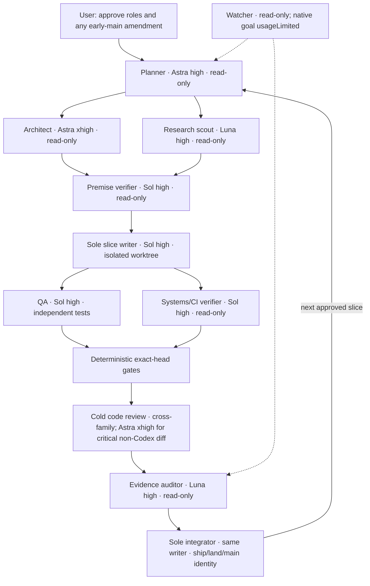

# Graphify fork delivery team — review draft

Status: REVIEW_READY, not approved or activated. Source: watcher direct user turn
`01a0e45e-57ed-7643-bc36-df68b9e573d6` (modular PRs and visual DAG), then
`55818` in the native watcher session (planner, architect, QA, code reviewer,
systems administrator). The later request `01a0e5bb-8c1c-7cc3-8ff4-4d66a9d1313a`
requires this gap to remain visible through compaction. This proposal does not
amend the six approved delivery tickets or authorize a second source writer.
The requested five-provider research is now recorded in
`GRAPHIFY-TEAM-RESEARCH-20260928.md`, including a failed first route, a
passing strict-five receipt, and primary Codex documentation checks. Model
and effort assignments remain proposals until user review.

| Role | Model / effort | Allowed tools and output | Stop or escalate |
| --- | --- | --- | --- |
| Planner | Astra high | Read approved GOAL/SPEC/TICKETS, issue/PR metadata, dependency DAG; produce one slice envelope with base SHA, paths, owner, tests and acceptance gates. | Escalate contradictory merge boundaries to user; never silently alter ticket 6. |
| Architect | Astra xhigh only for interacting or hard-to-reverse semantics | Read code, graph/report when available, official source; decide interface/invariants in a cited decision record. | No implementation; return unresolved premises to planner. |
| Research scout | Luna high | Bounded current-source searches under scoped fnox; Exa, Firecrawl, Last30Days, Context7, GitHub; report exact URLs/versions and failed arms. | Do not infer facts from unavailable providers or print secrets. |
| Premise verifier | Sol high, xhigh only for conflicting premises | Read-only source/receipt checks; mark each premise confirmed, refuted or unknown with file:line. | Refuse a writer packet with an unverified blocking premise. |
| Sole slice writer | Sol high | One isolated branch/worktree; git, mise, uv, pytest, graphify update; own all coupled source edits and exact-head receipts. | Stop on conflicting writer, dirty shared checkout or failed preflight; retain direct rc. |
| QA | Sol high | Independent test design and failure-class controls; run bounded tests in a separate read-only checkout or delegated test environment. | Report failures without rewriting source or acceptance. |
| Systems/CI verifier | Sol high | Read-only mise/fnox/runner/platform and GitHub Actions checks; direct child rc and hosted check identities. | Report environment faults separately from product defects. |
| Cold code reviewer | Existing cross-family review lane; Astra xhigh for critical non-Codex-authored diffs | Exact-head diff, frozen review method and findings with file:line; no source writes. | Refuse ambiguous author family or stale head; do not claim cross-family coverage without it. |
| Evidence auditor | Luna high | Hash/receipt/index comparison and open-gate list; no code edits. | Unknown model, partial run or green wrapper stays unknown/partial. |
| Sole integrator | Same delivery writer, Sol high | After approval and exact-head gates: project ship/land, remote merge SHA, clean local main fast-forward, next-slice rebase. | No early KB main merge until the user approves an amendment to ticket 6. |
| Watcher | Current watcher; read-only, native goal usageLimited | Native wait cursor, watch-probe and changed-evidence checks only. | Cannot reactivate its goal or edit the delivery checkout/index/goal. |

Each smaller-model packet must contain: exact base SHA and source inputs; one
owned output path and owner; ordered commands; positive, negative and mutation
controls; expected direct receipt schema; deadline; and explicit stop/escalation
conditions. Parallelism is limited to independent read-only research, QA design,
CI inspection and review. Only one writer owns coupled Graphify/KB changes.

Proposed slice rule: one reviewable behavior and one exact PR head per slice.
Qualify Graphify fork changes before publishing an immutable ref; KB slices
must preserve exact installed pin, source/lock/catalog/baseline/skill identities.
Any slice touching the protected extraction or dependency path retains its
applicable signed live receipt. Hosted CI, independent review, actual remote
merge and post-merge identity remain required. The active KB PR #822 and
approved ticket-6 merge boundary stay unchanged until the user reviews a
concrete per-slice amendment; this plan is not that amendment.

Existing KB roles are reused where their behavior matches: Astra advisor,
premise verifier, implementer and Astra reviewer. Their live TOMLs must be
checked at activation. The implementer currently describes a stopgap
`gpt-5.6-sol/xhigh` lane; changing it or adding roles belongs to the sole
delivery writer after approval and an isolated branch review.
