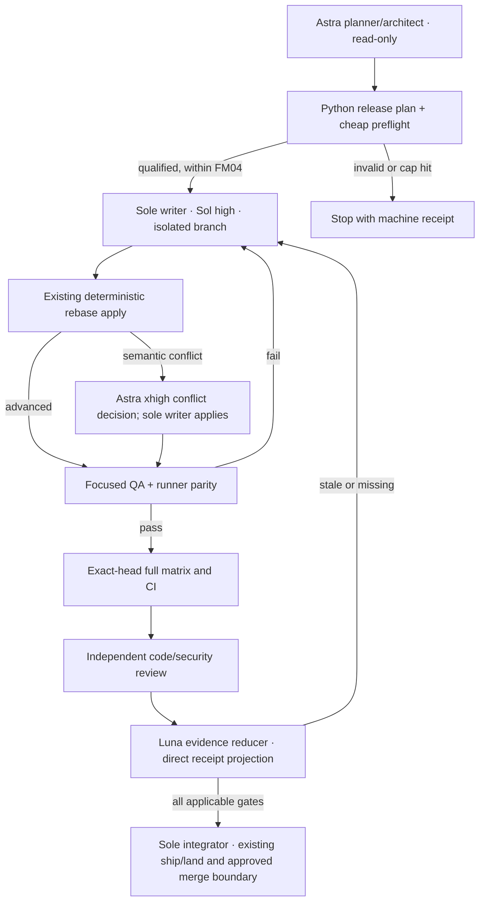

# Graphify release-rebase automation review — 2026-09-28

Status: REVIEW_READY handoff; no production code or delivery role changed. This is
a read-only audit by three Astra/high lanes (architecture, QA, systems) of
release-driven attempts through upstream v0.9.71. It extends the proposed
[team DAG](GRAPHIFY-SUBAGENT-DAG-20260928.md); it does not approve that DAG,
alter the six delivery tickets, permit an early KB main merge, reset FM04's
three-target-attempt bound, or replace any source/CI/live/review/main gate.
The Graphify/KB delivery chat `01a0ca59-2291-76a0-a5e7-bc6163a8567f` has
the sole source writer. The watcher owns only this handoff.

## Evidence and recurring failure classes

The authoritative attempt index is
`/Users/rmanaloto/.codex/visualizations/2026/09/22/01a0ca59-2291-76a0-a5e7-bc6163a8567f/goal-research/execution-start/evidence-index.json`.
Historical attempts are evidence of a failure class, not current acceptance.

| Target | Direct attempt evidence | Lesson to encode |
| --- | --- | --- |
| v0.9.66 | `attempts/release-20260924-001/` and `-002/` preview records; no apply. | Record preview versus actual apply explicitly. |
| v0.9.67 | release-004 apply and continuations in the index: apply `rc3`, CHANGELOG/cache/pyproject/lock conflicts. | Classify overlap and require conflict stop; previews do not predict semantic resolution. |
| v0.9.69 | `attempts/graphify-upstream-v0-9-69-20260926-01/`: apply `rc3`, three manual continues, generated skill files, omitted maintenance paths; subsequent `graphify-v0-9-69-local-extras-20260926-01/`. | Enumerate all candidate-owned paths; check installed extras before suites; verify generated parity. |
| v0.9.70 | `attempts/graphify-v0-9-70-20260927-01/` and `graphify-v0-9-70-ci-correction-20260927-02/`: apply `rc3`, generated Aider/Devin conflicts, hosted `mise` availability correction. | Preflight runner/toolchain parity before hosted qualification. |
| v0.9.71 | `attempts/graphify-v0-9-71-refresh-20260928-19/`: apply `rc3` on CHANGELOG; later candidate corrections, fixture and signature failures, stale AST provenance, publication evidence. | Front-load focused signature/fixture/path controls; invalidate old receipts on every candidate-head change. |

The index and direct receipts distinguish actual target attempts from manual
continuations and test corrections. The writer must reconcile the .67/.69/.70/.71
target ledger with FM04's approved cap and the later explicit .70/.71 target
selection; this review does not silently forgive or reset the cap. The v0.9.71
fork commit `3d6d280b81d92fe8856cf68ace196ee0e09930fc` has direct local suite,
graph, CI-terminal and publication-readback results; the KB integration is
still active. KB precommit `rc0` receipts at
`attempts/graphify-v0971-kb-integration-20260928-20/` do not establish the
eventual exact KB commit or post-merge identity.

Repeated diagnostic examples: v0.9.69 full suite first returned `rc1` with
100 failures from missing PIL/openai; the extras retake on the same candidate
passed. v0.9.71 focused suite first returned `rc1` with 79 missing-PIL failures.
One v0.9.71 full suite ran 412.8 seconds before a fixture-timing failure;
another ran 757.8 seconds before three signature test-double failures, later
localized by a 1.2-second focused retake. A graph update `rc0` with stale
`built_from` is not a fresh graph. Security wrappers and build wrappers must
expose child statuses; an outer green result cannot promote failing children.

## Proposed executable chain, in delivery-writer order

Reuse the installed Graphify fork-maintenance skill, canonical `fork-maintenance`
mise task and `tools/fork_maintenance.py`; reuse KB `kb-currency`, contract,
catalog, skill-refresh and gate tasks. Add only narrow entrypoints where these
existing pieces lack a predicate. The following names are proposals for the
sole writer to implement in its isolated branch, not commands already present.

| Priority | Modular Codex/Claude skill responsibility | Canonical mise task | Python function and receipt | Stop and acceptance control |
| --- | --- | --- | --- | --- |
| 1 | `graphify-fork-maintenance`: release intake and preflight, identical instructions in both agent clients | `fork-release-plan` → existing `fork-maintenance preview` | `tools/fork_maintenance.py::plan_release()` emits target tag, published time, non-yanked PyPI check, peeled upstream SHA, base/candidate SHA, target-attempt ordinal, overlap paths, generated-file set, expected extras and runner tools. | Refuse stale/unqualified target, dirty shared checkout, missing objects/mounts, or exhausted FM04 bound before apply. Positive qualified target, negative invalid target, and changed-source mutation. |
| 2 | Same skill: conflict-aware apply; only the sole writer mutates | existing `fork-maintenance apply` | `apply_release()` consumes the plan hash and emits `ADVANCED`, `NO_OP`, `CONFLICT_STOP`, `INVALID`, or `INTERRUPTED` with direct child rc and conflict paths. | No automatic semantic conflict resolution. Git rerere may suggest an exact previously resolved conflict, but the writer checks staged blobs and tests before continue. Replay unchanged plan gives NO_OP; changing target revalidates. |
| 3 | Small `graphify-fork-qualification` skill for QA and systems lanes; no source writes | `fork-qualify` | `preflight_qualification()` checks locked extras/imports, Python matrix, mise availability, generated skill parity, complete Git objects, fixture/signature slices and source-graph provenance; `run_qualification()` records each child rc/hash/head. | Cheap preflight and focused tests before expensive suites. Mutate one missing extra, one generated file, one stale graph `built_from`, and one failing child under green wrapper; all must refuse promotion. |
| 4 | Existing KB currency and skill-refresh skills; sole writer owns all coupled KB edits | existing `kb-currency`, `kb-currency-check`, `kb-skill-refresh`, then `kb-contract`/`kb-catalog`/`kb-gates` | KB `currency` module derives one exact fork pin and verifies lock, manifest, installed `direct_url`, SDK contract, generated skill and baseline catalog against it. | No second hand-written identity registry. Changed fork head invalidates old live/build/review receipts. Negative mismatch and changed-pin controls precede hosted/credentialed work. |
| 5 | Read-only evidence auditor wrapper, callable by either client | `fork-release-status` | `reduce_release_status()` projects one current state from immutable receipts, child outcomes and exact source identities; emits missing-gate IDs and stale projection warnings. | Positive exact-head pass, negative outer-rc0/child-fail, interrupted `rc143`, missing review, and changed-source mutation. Never marks partial evidence final. |

The skill file explains **when** to call the task, source owner, allowed tools,
inputs, stop/escalation and receipt schema. Mise gives one visible command name.
Python implements deterministic checks and serialization. Model agents decide
release semantics and review failures; they should not repeatedly parse logs,
rehash artifacts, rediscover missing extras, or update status prose by hand.

Use Astra high for plan/architecture and Astra xhigh only for ambiguous
conflict/security/cross-family cold review. Keep Sol high as the sole coupled
writer and QA/systems verifier; use Luna high for bounded source extraction or
receipt audits with exact schemas. Each agent packet names the frozen SHA,
source paths, one output, ordered task calls, receipt checks, deadline and
explicit stop condition. No second writer touches Graphify/KB. Native served
model identity remains unverified unless independently observed.

## Token-efficiency measurement, not a promised percentage

For each target attempt, record coordinator/subagent model calls and observed
input/output/cached/reasoning tokens when available; unknown remains unknown.
Count exact same-input task repeats and expensive suites avoided by a preflight
refusal, but distinguish changed-source revalidation and independent review.
Compare against the frozen `COMMAND-REPETITION-AUDIT-20260924.md` baseline
only after normalizing source/head, task argv, environment and receipt identity.
The watcher’s command-suffix audit is already in `mise run watch-probe`; do not
build another transcript parser. A heartbeat still consumes model work.

## Research and scope of proof

The strict-five source receipt is
`/Users/rmanaloto/.codex/research-coverage/01a0d0cb-95d1-7ed2-ad0c-5fc26c4fe92b/01a0e7c7-9138-7652-9051-d097360bdfa4/manifest.json`
(SHA-256 `f4676eff260778c1c64357ce413d3bf6e89d21110617eec86f1098f381e19202`).
The first fork-scoped attempt failed because the fork has no Discussions;
`attempt-01/` preserves it. A second run against `openai/codex` passed strict
provider coverage. Exa, Context7, Firecrawl developer/search, Last30Days and
GitHub issues/discussions/releases ran through fnox-scoped `research-fanout`;
`gh` separately searched repo code, issues and Graphify-Labs release metadata.
The OpenAI Docs and `codex-team-research` skills were read; official OpenAI
pages, source and Git documentation were fetched separately. Search coverage
does not approve the proposed roles or prove implementation.

Primary guidance: [Codex subagents](https://learn.chatgpt.com/docs/agent-configuration/subagents),
[GPT-6 model selection](https://developers.openai.com/api/docs/guides/latest-model),
[long-horizon tasks](https://developers.openai.com/blog/run-long-horizon-tasks-with-codex),
[skill/prompt design](https://developers.openai.com/blog/rethinking-skills-and-prompts-for-gpt-6-astra),
and [git rerere](https://git-scm.com/docs/git-rerere). The parallel read-only
lane and one-writer design is an inference from those sources plus this
delivery’s collision history, not an OpenAI-mandated team topology.

No automation code, role activation, new PR, or KB merge was performed by this
audit. The delivery sole writer should decide the smallest first production
slice, implement it in its own branch, run the controls above, checkpoint its
own native goal/status, and preserve all existing acceptance gates.
