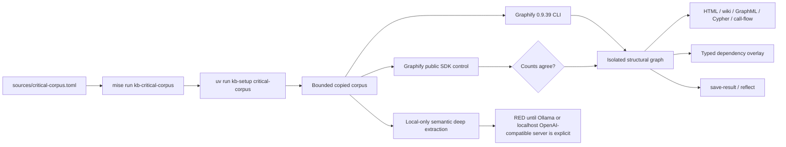

# Focused critical-dependency corpus — 2026-08-11

## Outcome

The isolated Graphify 0.9.39 structural build is reproducible and the CLI/public
SDK control agrees exactly. The semantic deep-extraction gate remains **RED**:
this checkout has no explicitly configured local model backend. The task does
not fall through to a paid API or silently call the host subscription.

| Gate | Result |
|---|---|
| Pinned Graphify runtime | 0.9.39 |
| Curated dependencies | 11 |
| Curated code inputs | 18 |
| Curated document inputs | 25 |
| Full-byte coverage witnesses (not extracted) | 2 |
| Graphify CLI built graph | 1,074 nodes / 3,390 edges |
| Public SDK `extract` + `build` control | 1,074 nodes / 3,390 edges |
| Selected file anchors | 17 of 18; `hk/src/main.rs` was fuzzy-deduplicated |
| Local semantic `--mode deep` | RED — `BLOCKED_NO_LOCAL_MODEL` |
| Generated views | report, diagnostics, tree, HTML, wiki, GraphML, Cypher, call-flow |
| Learning loop | `save-result` + `reflect` completed |

## Architecture



## Canonical dependency nodes

Canonical dependencies are typed navigation anchors in
`dependency-overlay.json`. They are not inserted into Graphify's structural
god-node ranking. Every anchor carries `god_node_eligible = false`; `SOURCE`
edges come from exact staged-file membership, and `DEPENDS_ON` edges come only
from the committed TOML.

## Run contract

```text
mise run kb-critical-corpus
```

For local semantic extraction, configure exactly one supported local lane:

```text
KB_CRITICAL_LOCAL_BACKEND=ollama mise run kb-critical-corpus
```

or a localhost OpenAI-compatible endpoint:

```text
KB_CRITICAL_LOCAL_BACKEND=openai
OPENAI_BASE_URL=http://127.0.0.1:8080/v1
OPENAI_MODEL=<locally-served-model>
mise run kb-critical-corpus
```

Remote OpenAI endpoints are rejected. The task always writes under
`graphify-out/critical/`; it never mutates `graphify-out/graph.json` and never
uses the full Ruff repository control corpus.

## Remaining red

The task cannot honestly claim bounded deep extraction until a local model is
project-managed and available. It also surfaced one structural loss shared by
both Graphify paths: the CLI and public SDK each fuzzy-deduplicated one node, and
the resulting graph has no file node for `hk/src/main.rs` (17 of 18 selected code
files can be anchored). Installing or selecting the model and resolving that
upstream deduplication behavior are outside this implementation lane; both reds
are retained in `build-result.json` / `dependency-overlay.json` instead of being
suppressed.
