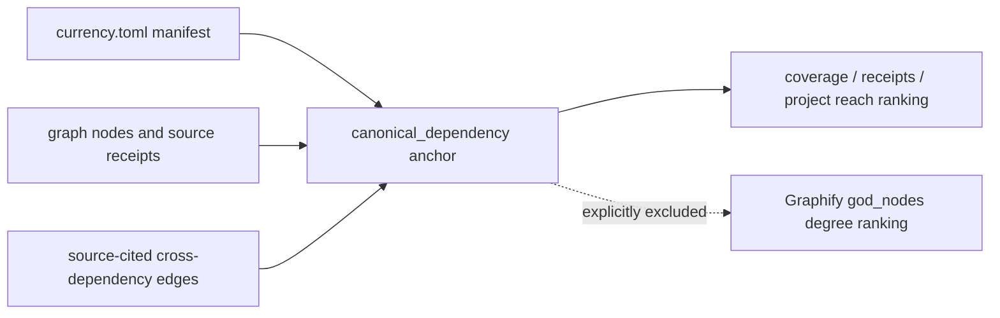

# Graphify dependency-anchor and limit integrity

## Outcome

The graph is queryable with Graphify 0.9.39, but dependency navigation is
**RED**. The exact streaming audit found 13 configured canonical dependencies,
two with no graph nodes, four required source gaps, and zero edges between any
pair of dependencies. No cross-link was invented to make the result green.

Canonical dependencies are typed navigation anchors, not graph-theory god
nodes. Graphify's god-node analysis measures high-degree real entities; changing
that list to force dependencies into it would corrupt the measurement. The
derived `graphify-out/dependency-anchors.json` therefore records
`type=canonical_dependency` and `god_node_eligible=false`, and exposes no degree
field. Anchor ordering uses graph-node coverage, unique source-file receipts,
then the count of other canonical dependencies reached.

## Live measurements

`mise run kb-graph-integrity` against the 641 MiB aggregate graph reported:

- 13 configured typed anchors;
- 0 cross-dependency edges;
- no graph coverage for `ruff` or `chezmoi`;
- `mattpocock-skills` is now a source-only currency dependency with 199 graph
  nodes and 6 source-file receipts;
- `codex` has 74,451 primary-repository nodes, but its required
  `agent-harness-docs/docs/codex/` subtree has no graph coverage;
- the shared `agent-harness-docs/docs/claude-code/` subtree attaches to the
  `claude-code` anchor (254 nodes and 4 receipts), but the required primary
  `claude-code` repository source has no graph coverage;
- shared documentation prefixes are disjoint and separately measured;
  overlapping prefix declarations fail closed, so an offline-doc subtree can
  neither attach to both harnesses nor mask a missing primary source;
- `ty` has only 36 nodes and 9 source-file receipts;
- `codex`, `uv`, `mise`, `graphify`, `agnix`, `fnox`, `skillopt`, and `hk`
  have graph coverage but reach no other configured dependency.

The task exits nonzero for that state. Its follow-up contract is deliberately
semantic: add source-cited relations, rebuild, and require at least one real
typed edge. Co-presence, shared words, or a synthetic anchor edge do not count.

The four source gaps reported by the live task are:

1. `codex:agent-harness-docs/docs/codex/`;
2. `claude-code:repo:claude-code`;
3. `ruff:repo:ruff`;
4. `chezmoi:repo:chezmoi`.

## Four different limits

The user-visible `TRUNCATED` query result is a display bound controlled by
`graphify query --budget N` (default about 2,000 tokens). The three environment
variables answer different questions:

| Setting | Surface | Current effective value |
|---|---|---:|
| query `--budget` | displayed BFS/DFS subgraph | 2,000 tokens |
| `GRAPHIFY_MAX_OUTPUT_TOKENS` | semantic LLM response | backend default |
| `GRAPHIFY_MAX_GRAPH_BYTES` | pre-parse graph-file safety cap | 1 GiB |
| `GRAPHIFY_MAX_CONTEXTS` | MCP server project-context LRU | 8 |

Raising any of the three environment variables does not reveal nodes cut by the
query display budget. Raise `--budget`, narrow the vocabulary, select a context,
or retrieve a specific node instead.

The 1 GiB graph cap is load-bearing: the aggregate graph is above Graphify's
512 MiB default. It must continue to run through the mise task so the project
environment reaches Graphify.

## Source-download cutoff boundary

This work did not create a second downloader. The existing `kb_setup.fetch`
boundary already bypasses Graphify's still-present 12,000-character webpage
slice, writes complete content with a hash and character count, and mutation
tests truncation and rewriting. The curator owns extending those receipts to
new offline documentation sources.

## Verification

- focused `kb-check`: Ruff, Ruff format, ty, and 34 tests green, including the
  real CLI dispatch seam;
- `mise tasks validate --json`: exit 0;
- `git diff --check`: exit 0;
- live `mise run kb-graph-integrity`: expected RED, producing the typed artifact
  and proving the failing control can fire.

The whole-repository `mise run lint` was also executed and is not green. Its
failures are outside this change: generated/imported Graphify skill Markdown
needs rumdl formatting, and the concurrently added `kb_setup.lessons` module
has an unresolved `Result` annotation. The focused Python gate above is green;
the repository gate must be rerun after those owners repair their paths.

`mise run kb-currency-check -- --tool mattpocock-skills` successfully loaded
the new source-only declaration and reported an honest `NOT CHECKED`: no
upstream baseline has yet been recorded. The next reviewed currency run must
write that baseline; this audit does not manufacture one.
