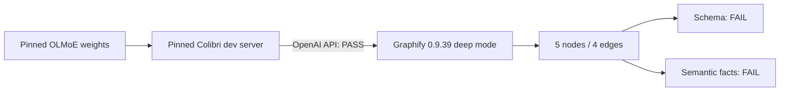

# Colibri OLMoE -> Graphify 0.9.39 canary

Date: 2026-08-11

## Verdict

Colibri can serve OLMoE to Graphify over the OpenAI-compatible API, but this
model/configuration is **not acceptable for critical deep extraction**. The
transport passed; Graphify's schema and the semantic correctness controls failed.



## Immutable inputs

- Colibri commit: `2c8ce27d27537f54a1fbdafdbeee45b57bd2c71b`
- OLMoE model: `allenai/OLMoE-1B-7B-0125-Instruct`
- Model revision: `b89a7c4bc24fb9e55ce2543c9458ce0ca5c4650e`
- Graphify: `0.9.39`
- Host: Apple M2 Max, 96 GiB unified memory
- Context: 4,096 tokens; output cap: 1,024; concurrency: 1; expert cache: 64

The official source checkpoint was 13.84 GB and took 35m07s to download on the
observed connection. Conversion produced five shards totaling 6.9 GB, covering
1,024 experts and 147 dense tensors.

## Measured result

| Check | Result | Evidence |
|---|---:|---|
| Colibri server startup | PASS | 1.012-1.022s across repeats |
| Raw chat completion | PASS | 1.699-2.682s, 31 prompt + 7 completion tokens |
| Graphify deep extraction | command PASS | 48.957-49.614s |
| Graph output | produced | 5 nodes, 4 edges, 2 communities |
| Repeat determinism | PASS | graph SHA-256 `f82fd7a647bafd77439c4b8b2fd48a6ab9586d36c2cf0d77f22ddfcddce03d9e` |
| Graphify schema | FAIL | four edges omitted required `source_file` in model output |
| Required concepts | FAIL | 5/8 found; Knowledge Base, Currency Task, Verification Gate missing |
| Required relationships | FAIL | 0/4 correct source-relation-target triples |

The generated relationships were materially wrong. Examples include `Dotfiles
consumes Graphify`, `CLI publishes Graphify`, and `Release Notes reviews CLI`.
Graphify repaired missing provenance fields after validation, but assigned
`graphify.py` to inferred entities even though the only input was
`dependency-workflow.md`. A nonempty graph therefore cannot be treated as a
quality pass.

## Reusable execution path

The canary follows the required automation chain:

```text
graphify skill -> mise run kb-colibri-canary -> kb_setup.colibri_canary
```

It pins both source and model revisions, downloads with the uv-managed task
environment, builds the real C engine, starts a loopback-only authenticated
server, runs a raw request, runs Graphify deep mode, scores a frozen contract,
and terminates the server. Results remain isolated below a caller-selected work
directory; the aggregate knowledge graph is untouched.

## Decision

Keep Colibri in the evaluation set, not the selected critical-extraction
backend. Re-test a stronger Colibri-supported model only if its storage/runtime
cost is practical, or re-test OLMoE after Graphify can request constrained JSON
and the model passes the same frozen semantic controls. Do not use the earlier
`agy-graphify-research` benchmark as evidence; it never loaded weights and used
a heuristic fallback.
